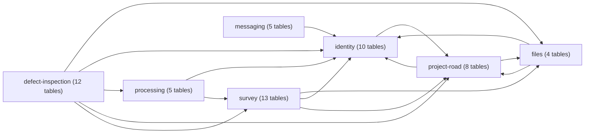
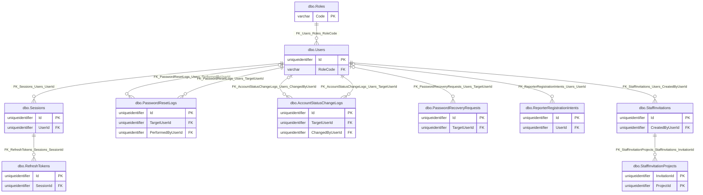
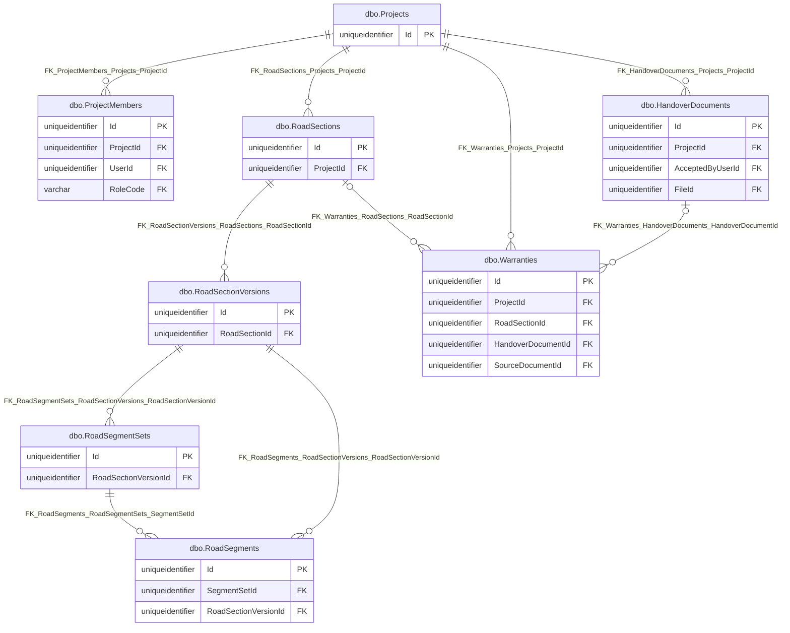
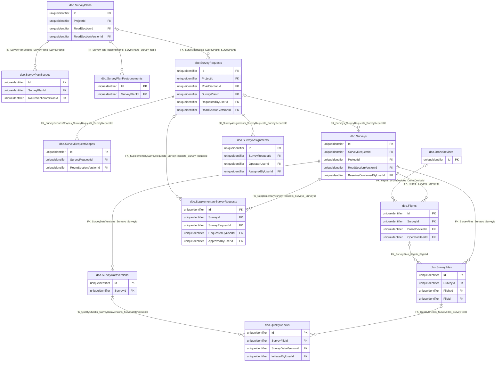
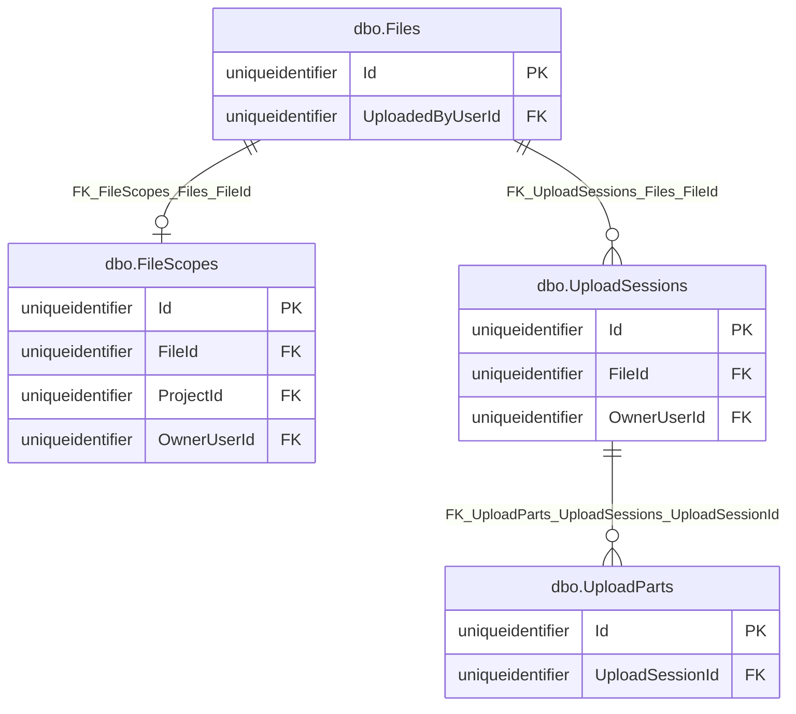
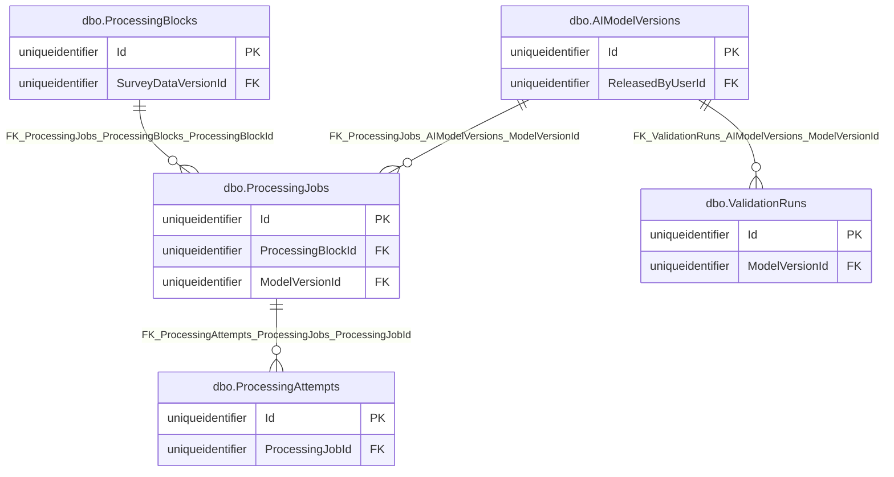
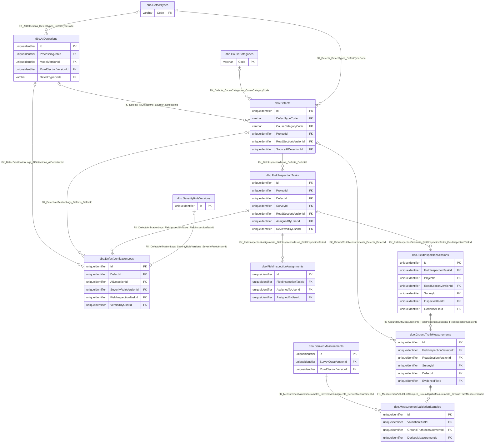
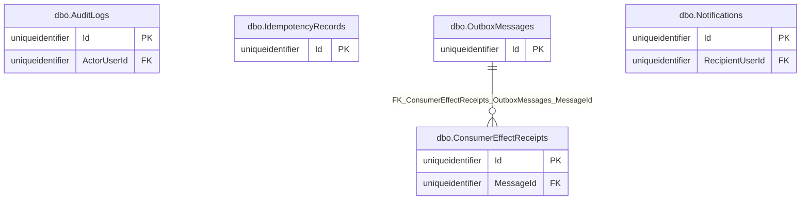

# Current relational ERD

CURRENT_VERIFIED from [isolated SQL inventory](current-schema.inventory.json). Each Mermaid entity displays the exact `dbo.Table` name; `dbo_Table` is its internal Mermaid identifier. Table headings in the [dictionary](current-data-dictionary.md) give exact names. Solid relationships below exist in `sys.foreign_keys`. No edge is inferred from a property name.

## Module overview

Arrows indicate child-module FK dependency on principal module, not transaction or service ownership. Cross-module FK details are in the per-table dictionary.

## identity

Cross-module enforced FK (full composite columns and delete behavior: [dictionary](current-data-dictionary.md)):

- dbo.StaffInvitationProjects -> dbo.Projects via FK_StaffInvitationProjects_Projects_ProjectId.

## project-road

Cross-module enforced FK (full composite columns and delete behavior: [dictionary](current-data-dictionary.md)):

- dbo.HandoverDocuments -> dbo.Files via FK_HandoverDocuments_Files_FileId.
- dbo.HandoverDocuments -> dbo.Users via FK_HandoverDocuments_Users_AcceptedByUserId.
- dbo.ProjectMembers -> dbo.Roles via FK_ProjectMembers_Roles_RoleCode.
- dbo.ProjectMembers -> dbo.Users via FK_ProjectMembers_Users_UserId.
- dbo.Warranties -> dbo.Files via FK_Warranties_Files_SourceDocumentId.

## survey

Cross-module enforced FK (full composite columns and delete behavior: [dictionary](current-data-dictionary.md)):

- dbo.Flights -> dbo.Users via FK_Flights_Users_OperatorUserId.
- dbo.QualityChecks -> dbo.Users via FK_QualityChecks_Users_InitiatedByUserId.
- dbo.SupplementarySurveyRequests -> dbo.Users via FK_SupplementarySurveyRequests_Users_ApprovedByUserId.
- dbo.SupplementarySurveyRequests -> dbo.Users via FK_SupplementarySurveyRequests_Users_RequestedByUserId.
- dbo.SurveyAssignments -> dbo.Users via FK_SurveyAssignments_Users_AssignedByUserId.
- dbo.SurveyAssignments -> dbo.Users via FK_SurveyAssignments_Users_OperatorUserId.
- dbo.SurveyFiles -> dbo.Files via FK_SurveyFiles_Files_FileId.
- dbo.SurveyPlans -> dbo.Projects via FK_SurveyPlans_Projects_ProjectId.
- dbo.SurveyPlans -> dbo.RoadSections via FK_SurveyPlans_RoadSections_RoadSectionId.
- dbo.SurveyPlans -> dbo.RoadSectionVersions via FK_SurveyPlans_RoadSectionVersions_RoadSectionVersionId.
- dbo.SurveyPlanScopes -> dbo.RoadSectionVersions via FK_SurveyPlanScopes_RoadSectionVersions_RouteSectionVersionId.
- dbo.SurveyRequests -> dbo.Projects via FK_SurveyRequests_Projects_ProjectId.
- dbo.SurveyRequests -> dbo.RoadSections via FK_SurveyRequests_RoadSections_RoadSectionId.
- dbo.SurveyRequests -> dbo.RoadSectionVersions via FK_SurveyRequests_RoadSectionVersions_RoadSectionVersionId.
- dbo.SurveyRequests -> dbo.Users via FK_SurveyRequests_Users_RequestedByUserId.
- dbo.SurveyRequestScopes -> dbo.RoadSectionVersions via FK_SurveyRequestScopes_RoadSectionVersions_RouteSectionVersionId.
- dbo.Surveys -> dbo.Projects via FK_Surveys_Projects_ProjectId.
- dbo.Surveys -> dbo.RoadSectionVersions via FK_Surveys_RoadSectionVersions_RoadSectionVersionId.
- dbo.Surveys -> dbo.Users via FK_Surveys_Users_BaselineConfirmedByUserId.

## files

Cross-module enforced FK (full composite columns and delete behavior: [dictionary](current-data-dictionary.md)):

- dbo.Files -> dbo.Users via FK_Files_Users_UploadedByUserId.
- dbo.FileScopes -> dbo.Projects via FK_FileScopes_Projects_ProjectId.
- dbo.FileScopes -> dbo.Users via FK_FileScopes_Users_OwnerUserId.
- dbo.UploadSessions -> dbo.Users via FK_UploadSessions_Users_OwnerUserId.

## processing

Cross-module enforced FK (full composite columns and delete behavior: [dictionary](current-data-dictionary.md)):

- dbo.AIModelVersions -> dbo.Users via FK_AIModelVersions_Users_ReleasedByUserId.
- dbo.ProcessingBlocks -> dbo.SurveyDataVersions via FK_ProcessingBlocks_SurveyDataVersions_SurveyDataVersionId.

## defect-inspection

Cross-module enforced FK (full composite columns and delete behavior: [dictionary](current-data-dictionary.md)):

- dbo.AIDetections -> dbo.AIModelVersions via FK_AIDetections_AIModelVersions_ModelVersionId.
- dbo.AIDetections -> dbo.ProcessingJobs via FK_AIDetections_ProcessingJobs_ProcessingJobId.
- dbo.AIDetections -> dbo.RoadSectionVersions via FK_AIDetections_RoadSectionVersions_RoadSectionVersionId.
- dbo.Defects -> dbo.Projects via FK_Defects_Projects_ProjectId.
- dbo.Defects -> dbo.RoadSectionVersions via FK_Defects_RoadSectionVersions_RoadSectionVersionId.
- dbo.DefectVerificationLogs -> dbo.Users via FK_DefectVerificationLogs_Users_VerifiedByUserId.
- dbo.DerivedMeasurements -> dbo.RoadSectionVersions via FK_DerivedMeasurements_RoadSectionVersions_RoadSectionVersionId.
- dbo.DerivedMeasurements -> dbo.SurveyDataVersions via FK_DerivedMeasurements_SurveyDataVersions_SurveyDataVersionId.
- dbo.FieldInspectionAssignments -> dbo.Users via FK_FieldInspectionAssignments_Users_AssignedByUserId.
- dbo.FieldInspectionAssignments -> dbo.Users via FK_FieldInspectionAssignments_Users_AssignedToUserId.
- dbo.FieldInspectionSessions -> dbo.Files via FK_FieldInspectionSessions_Files_EvidenceFileId.
- dbo.FieldInspectionSessions -> dbo.Projects via FK_FieldInspectionSessions_Projects_ProjectId.
- dbo.FieldInspectionSessions -> dbo.RoadSectionVersions via FK_FieldInspectionSessions_RoadSectionVersions_RoadSectionVersionId.
- dbo.FieldInspectionSessions -> dbo.Surveys via FK_FieldInspectionSessions_Surveys_SurveyId.
- dbo.FieldInspectionSessions -> dbo.Users via FK_FieldInspectionSessions_Users_InspectorUserId.
- dbo.FieldInspectionTasks -> dbo.Projects via FK_FieldInspectionTasks_Projects_ProjectId.
- dbo.FieldInspectionTasks -> dbo.RoadSectionVersions via FK_FieldInspectionTasks_RoadSectionVersions_RoadSectionVersionId.
- dbo.FieldInspectionTasks -> dbo.Surveys via FK_FieldInspectionTasks_Surveys_SurveyId.
- dbo.FieldInspectionTasks -> dbo.Users via FK_FieldInspectionTasks_Users_AssignedByUserId.
- dbo.FieldInspectionTasks -> dbo.Users via FK_FieldInspectionTasks_Users_ReviewedByUserId.
- dbo.GroundTruthMeasurements -> dbo.Files via FK_GroundTruthMeasurements_Files_EvidenceFileId.
- dbo.GroundTruthMeasurements -> dbo.RoadSectionVersions via FK_GroundTruthMeasurements_RoadSectionVersions_RoadSectionVersionId.
- dbo.GroundTruthMeasurements -> dbo.Surveys via FK_GroundTruthMeasurements_Surveys_SurveyId.
- dbo.MeasurementValidationSamples -> dbo.ValidationRuns via FK_MeasurementValidationSamples_ValidationRuns_ValidationRunId.

## messaging

Cross-module enforced FK (full composite columns and delete behavior: [dictionary](current-data-dictionary.md)):

- dbo.AuditLogs -> dbo.Users via FK_AuditLogs_Users_ActorUserId.
- dbo.Notifications -> dbo.Users via FK_Notifications_Users_RecipientUserId.

Logical application links without a SQL FK are intentionally omitted; inspect service/persistence code before drawing any such edge. On an edge principal-to-child, `||` means the child FK is required and `o|` means nullable; `o{` means zero-to-many child rows and `o|` zero-to-one when an exact unique FK index exists. Composite columns and delete behavior are in the dictionary.
