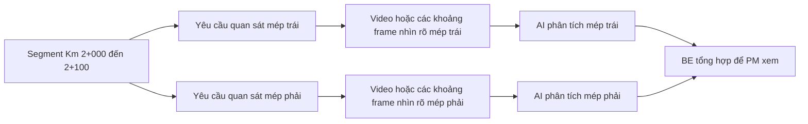
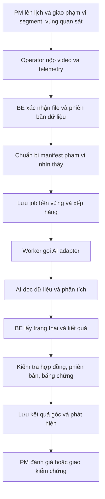

# RoadGuard — Tích hợp AI theo segment và khảo sát mép đường

Ngày: 22/09/2026. Trạng thái: thiết kế đề xuất; chưa triển khai transport AI hoặc thay đổi backend.

Tài liệu bổ sung cho [Thiết kế phản ánh và segment](RoadGuard_Incident_Segment_Design_v1.md), theo yêu cầu hệ thống có AI bên ngoài, PM chỉnh segment tới 100 m và khảo sát được vết mẻ hai mép đường. Các tên payload/API dưới đây là hợp đồng đề xuất, không phải endpoint đã tồn tại.

## 1. Quyết định thiết kế

- RoadGuard BE quản lý dự án, tuyến chuẩn, segment, lịch bay, dữ liệu và quyết định nghiệp vụ. AI nhận dữ liệu cần thiết, chạy phân tích và trả phát hiện/bằng chứng/chất lượng.
- Ưu tiên đơn vị phân tích logic là một segment và một vùng quan sát trong một phiên bản dữ liệu khảo sát. Kích thước batch xử lý GPU có thể khác đơn vị quản lý này.
- Giữ video gốc một lần trong storage; gửi manifest và quyền đọc tệp giới hạn phạm vi. Không gửi lại toàn bộ dự án hoặc nhân bản cả video cho từng segment.
- Trái/phải định nghĩa theo chiều tăng lý trình. Vị trí bay lệch có chủ đích để nhìn mép đường không mặc nhiên là lỗi định vị.
- Kết quả AI là bằng chứng/ứng viên phát hiện để PM đánh giá; không tự kết luận phản ánh là thật, duyệt sửa hoặc nghiệm thu.

Nền tảng hiện có: `ProcessingBlock` gắn `SurveyDataVersionId` và có `RangeMetadata`; `ProcessingJob` gắn block/model; `AIDetection` có job, model, geometry tùy chọn, confidence và raw payload. Thiết kế nên mở rộng chúng, không tạo một hệ job độc lập trùng trách nhiệm.

Tài liệu cũ dự kiến mock AI và adapter cho tích hợp sau. Yêu cầu mới bổ sung tích hợp hệ AI bên ngoài qua cùng ranh giới hợp đồng. Việc đọc các entity không chứng minh worker/adapter HTTP đã triển khai; cần kiểm tra triển khai cụ thể khi bắt đầu code. Đề xuất không bao gồm huấn luyện mô hình AI hoặc chứng nhận độ chính xác của mô hình.

## 2. Ba loại phạm vi phải tách biệt

| Phạm vi | Ví dụ | Mục đích |
|---|---|---|
| Segment quản lý | Km 2+000–2+100, thuộc bộ segment V2 | Giao việc, liên kết lỗi, báo cáo |
| Lượt bay và vùng quan sát | Lượt A quay mép trái qua 10 segment | Tổ chức thu dữ liệu; không cần một lượt bay mỗi segment |
| ProcessingBlock | Dữ liệu nhìn thấy mép trái của segment trên, có phần ngữ cảnh | Retry, kết quả AI và theo dõi chất lượng |

100 km chia 100 m tạo 1.000 segment. Nếu chỉ cần kiểm tra hai mép, có thể có tới 2.000 đơn vị logic trước khi tính các đợt khảo sát/lần chạy lại; đây không phải yêu cầu 2.000 chuyến bay, lần upload hoặc HTTP request riêng. Worker giới hạn số job đồng thời và có thể gửi batch để AI tận dụng GPU, nhưng mỗi đơn vị phải có kết quả/tiến độ truy vết được.

Có thể phân tích theo một video/lượt bay lớn rồi BE phân kết quả về segment. Cách này giảm việc giải mã lặp, nhưng cần API AI trả đủ timestamp/vùng quan sát và hỗ trợ resume/kết quả từng phần. Khuyến nghị khởi đầu dùng block nhỏ truy vết được, rồi gom batch/cache phần giải mã khi đo được nhu cầu hiệu năng; không gửi một job toàn dự án không có checkpoint.

## 3. Segment chỉnh được và kết quả AI có phiên bản

PM được đổi chiều dài mục tiêu, chia, gộp hoặc kéo mốc dọc tuyến. Segment mới được xác định bằng `SegmentSetId + SegmentId + RoadSectionVersionId`, không chỉ tên như SEG-001.

- Bản nháp được sửa trước công bố; bộ đã công bố tạo phiên bản mới khi chỉnh.
- Job đang chờ/chạy và kết quả cũ giữ bộ segment đã chụp lúc tạo job, không bị cập nhật sang bộ mới.
- BE lưu lý trình/vị trí và độ tin cậy của phát hiện bên cạnh ID segment, khi có dữ liệu đủ tốt. Nhờ đó có thể ánh xạ lại sang bộ segment mới trên cùng tuyến, giữ bản ánh xạ và nguồn gốc.
- Chỉ biết phát hiện thuộc segment 1 km không đủ để khẳng định nó thuộc segment con 100 m nào. Cần xem bằng chứng, định vị lại hoặc chạy lại phần cần thiết.
- Đổi model, tiền xử lý, phạm vi hoặc phiên bản dữ liệu tạo lần phân tích mới. Retry do lỗi mạng của cùng input giữ cùng danh tính job/idempotency.

## 4. Hai mép đường và quy tắc vị trí

Mỗi yêu cầu khảo sát có một hoặc nhiều `TargetBand`: `Surface`, `LeftEdge`, `RightEdge`. Đây là vùng cần nhìn thấy, không phải vị trí bắt buộc của drone. Phần đường/làn hoặc mép dải phân cách cần mã phạm vi bổ sung khi có nhiều phần đường; MVP phải cho PM xác nhận đang nói tới mép nào.

Quy ước cố định: nhìn theo chiều tăng lý trình thì xác định trái/phải; đổi hướng bay không đổi quy ước. Có thể dùng độ lệch ngang có dấu cho vị trí đã định vị đáng tin cậy, với trái dương/phải âm theo quy ước dự án; không suy ra bên của lỗi chỉ từ dấu vị trí drone.

Một lượt có thể phục vụ nhiều vùng nếu ảnh đủ rõ; một vùng có thể cần nhiều lượt vì bị che khuất. Không bắt luôn có ba lượt bay. Cấu hình bay cần được thử nghiệm với camera, địa hình, độ cao, góc nhìn và kích thước vết mẻ cần phát hiện; chưa có dữ liệu thực nghiệm thì không đặt góc/độ cao/offset “chuẩn” cố định.

Giữ riêng các thông tin:

| Thông tin | Ý nghĩa |
|---|---|
| Raw aircraft GPS | Vị trí thiết bị ghi nhận, timestamp và độ chính xác nếu có |
| Planned flight corridor | Phạm vi bay dự kiến; có thể nằm lệch tim đường |
| Camera pose/calibration | Góc camera, thông số camera, độ cao và hệ quy chiếu khi có |
| Observed footprint / confirmed ROI | Vùng mặt đường thực nhìn thấy hoặc vùng PM xác nhận |
| Matched route station | Lý trình tham chiếu cùng phương pháp/độ tin cậy |
| Defect location | Vị trí lỗi suy ra có căn cứ; có thể chưa biết |

GPS lệch với tim tuyến không tự là GPS sai. Cần kiểm tra track so với hành lang bay, liên tục theo thời gian và dữ liệu định vị; độ phủ hình ảnh được đánh giá riêng cho vùng quan sát. Bay bên trái nhưng camera hướng sang phải vẫn có thể quan sát mép phải.

GPS thường và SRT đơn lẻ không đủ để định vị chính xác mọi pixel lỗi trong góc quay nghiêng. Nếu chưa có pose/calibration/mặt đường tham chiếu đủ tốt, AI trả bbox/mask, frame/time, bên dự kiến và phạm vi lý trình ước lượng; không tạo tọa độ chính xác giả. PM kiểm tra hoặc Crew đo bổ sung khi cần. RTK/GCP/orthophoto có thể cải thiện định vị nhưng cần quy trình đo và đánh giá thực tế [T2], không tự là phạm vi bắt buộc của MVP.

## 5. Luồng xử lý bất đồng bộ

Không giữ một HTTP request của FE chờ GPU xử lý xong. BE trả `202 Accepted` cùng JobId/status URL sau khi đã lưu job; worker xử lý riêng. FE xem trạng thái BE; BE adapter theo dõi job AI. Mẫu async request/reply có polling/status endpoint phù hợp hướng này [T1]. Không yêu cầu một nhà cung cấp cloud hay broker cụ thể; có thể dùng cơ chế job/outbox bền vững hiện có sau khi xác nhận triển khai.

Chỉ tạo job từ manifest dữ liệu đã xác nhận toàn vẹn. Việc model có đủ chất lượng đầu vào cho một vùng vẫn là kiểm tra riêng; input hợp lệ về checksum không chứng minh ảnh nhìn rõ mép đường.

Đề xuất hợp đồng AI MVP:

| Thao tác | Hành vi |
|---|---|
| `POST /analysis-jobs` | Xác thực service, kiểm tra schema; nhận JobId/idempotency key của BE và manifest; trả 202 + AiJobId/status URL |
| `GET /analysis-jobs/{id}` | Trả queued/running/succeeded/failed/cancelled, tiến độ các block và nguyên nhân lỗi |
| `GET /analysis-jobs/{id}/result` | Kết quả có phiên bản, JobId/input checksum/model khớp request; chỉ đọc khi đã có kết quả |

BE polling với khoảng chờ/backoff theo khả năng AI. Callback là mở rộng nếu hệ AI hỗ trợ; phải xác thực và xử lý trùng tương tự, không đồng thời có hai nguồn tự do ghi đè trạng thái. Nếu AI chỉ có API đồng bộ, worker BE vẫn gọi ngoài vòng đời request FE và cần timeout/idempotency phù hợp.

## 6. Manifest BE gửi cho AI

| Nhóm | Trường cần thiết |
|---|---|
| Danh tính | ContractVersion, BackendJobId, CorrelationId, ProjectId, SurveyId, SurveyDataVersionId |
| Phạm vi | RoadSectionVersionId, SegmentSetId, SegmentId, StartOffsetM, EndOffsetM, TargetBand; phần đường nếu có |
| Hình học | Đường chuẩn/phạm vi con cần thiết, chiều lý trình, hệ tọa độ và đơn vị |
| Nguồn video | FileId, checksum, quyền đọc, VideoId, FlightId, các khoảng thời gian theo video gốc |
| Dữ liệu phụ trợ | SRT/telemetry checksum, ánh xạ thời gian, pose/calibration khi có; nêu rõ dữ liệu nào không có |
| Nội dung phân tích | Loại hư hỏng cần tìm, model version được chọn, preprocessing/config version |
| Chất lượng/ngữ cảnh | Phạm vi chính, phạm vi ngữ cảnh mở rộng và chất lượng định vị/ảnh được biết |

Ví dụ một block: segment V2/S021 ở lý trình 2.000–2.100 m, TargetBand=LeftEdge, dùng video F01 từ 140–158 giây và F02 từ 20–25 giây để bổ sung vùng bị khuất. Những mốc giây này chỉ là ví dụ hợp đồng, phải lấy từ dữ liệu thật và kiểm chứng phạm vi nhìn thấy.

Không gửi thông tin tài khoản, ảnh Reporter không liên quan, thông tin cá nhân, phê duyệt hoặc dữ liệu sửa chữa nội bộ cho AI khi nhiệm vụ chỉ phân tích video. URL tải dữ liệu phải giới hạn tệp/quyền/thời hạn hoặc dùng API storage có service authentication; hết hạn được cấp lại cho cùng file/checksum, không đổi danh tính input. Kết quả AI không được yêu cầu BE tải URL tùy ý ngoài storage được phép.

Ưu tiên AI cache/tải video gốc một lần và giải mã các khoảng được yêu cầu. Nếu hệ AI chỉ nhận clip thì worker tạo tệp dẫn xuất, lưu checksum và ánh xạ `clip time -> original video time`; không làm mất SRT/telemetry đi kèm hoặc ghi đè bản gốc.

## 7. Kết quả AI trả về

Mỗi kết quả xác định cùng JobId, block/input manifest checksum, model/config version và nguồn AI thật/mock. Mỗi detection có ID ổn định trong kết quả job để xử lý trả lại/retry mà không nhân đôi.

| Nhóm | Dữ liệu đầu ra |
|---|---|
| Loại phát hiện | DefectType, confidence; không coi confidence là xác suất bảo đảm đúng nếu chưa hiệu chuẩn |
| Bằng chứng | File/video gốc, timestamp/frame và bbox/mask với quy ước pixel hoặc chuẩn hóa rõ ràng |
| Vùng quan sát | TargetBand yêu cầu, bên quan sát suy ra nếu có, độ tin cậy và trạng thái chưa xác định |
| Định vị | Lý trình hoặc khoảng lý trình, tọa độ/hình học nếu có căn cứ, hệ tọa độ, phương pháp và sai số/độ tin cậy |
| Kích thước | Giá trị/đơn vị/phương pháp nếu đo được; phân biệt ước lượng 2D và đo vật lý; có thể không có |
| Chất lượng | Phạm vi đã xử lý, phần nhìn rõ/phần thiếu, lỗi mờ/che khuất/thiếu định vị khi xác định được |
| Truy vết | ModelVersion, InputManifestChecksum, PreprocessingVersion và kết quả gốc |

Không dùng một trường “GPS” cho cả vị trí drone và lỗi. Nếu không định vị được lỗi, trả null/unknown với bằng chứng hình ảnh; nếu không suy ra được bên, không tự sao chép nhãn nhiệm vụ thành kết luận đã nhìn đúng bên.

Trạng thái xử lý và khả năng kết luận phải tách biệt:

- `Succeeded` nghĩa là AI chạy xong; có thể vẫn có vùng không đủ dữ liệu.
- `No detections` chỉ là không có phát hiện trong dữ liệu đã xử lý, không phải PM kết luận “Không phải lỗi”.
- Đánh giá đủ phạm vi dùng từng segment/vùng quan sát, ví dụ `Sufficient`, `Partial`, `Insufficient`, `Unknown`; đây là trạng thái đề xuất, không phải enum hiện có.
- Mép trái đủ nhưng mép phải thiếu thì giữ kết quả trái và bổ sung phải; không cần chạy lại toàn dự án.
- BE kiểm tra schema, quyền/phạm vi, phiên bản, confidence hợp lệ, timestamp trong nguồn, bbox trong frame và tệp bằng chứng trước khi chấp nhận kết quả. Raw payload giữ bất biến.

## 8. Phát hiện gần ranh giới và nhiều lượt bay

Không cắt mất ngữ cảnh ngay tại biên 100 m. Mỗi block có vùng chính và vùng ngữ cảnh mở rộng theo nhu cầu model; độ mở rộng được cấu hình/đánh giá, không mặc định một độ dài thích hợp mọi loại lỗi. Có thể tái sử dụng các frame cùng video cho hai block lân cận.

AI có thể nhìn thấy cùng một lỗi qua nhiều frame, hai block hoặc hai lượt bay. BE lưu các quan sát gốc, sau đó gợi ý nhóm dựa trên vị trí/phạm vi, thời gian khảo sát, loại lỗi, bên đường và bằng chứng. Không chỉ so tọa độ gần nhau: hai mép đối diện có thể là hai lỗi khác nhau. Trường hợp mơ hồ để PM quyết định.

Một lỗi vắt qua ranh giới được biểu diễn một Defect cùng nhiều quan sát và liên kết các segment bị ảnh hưởng, không nhân đôi hồ sơ sửa. Chọn một segment chính theo quy tắc cố định như vị trí tâm khi đủ tin cậy, giữ danh sách đầy đủ các segment liên quan. Chưa định vị đủ thì để phạm vi ứng viên và chờ xác minh.

Giữa hai đợt bay, chỉ gợi ý “có thể là cùng lỗi” dựa trên tuyến/phiên bản, lý trình, bên, loại và bằng chứng; không ghi đè quan sát cũ. Điều này giúp so sánh trước/sau sửa hoặc phát hiện tái phát mà không mất lịch sử.

## 9. Retry, lỗi và hoàn tất

- BE lưu job và yêu cầu thực thi bền vững trước khi dispatch. Restart worker không mất job.
- AI nhận cùng BackendJobId/idempotency key và cùng fingerprint phải trả cùng job; payload khác cùng key phải bị từ chối. Fingerprint gồm input manifest, scope, model và cấu hình; không dựa vào URL tạm có thể hết hạn.
- Mất kết nối sau khi AI nhận job: BE truy vấn theo danh tính đã gửi rồi tiếp tục theo dõi, không tạo job mới không kiểm soát.
- Lỗi tạm thời retry có giới hạn/backoff; thiếu tệp, video hỏng, schema không hỗ trợ hoặc thiếu dữ liệu cần thiết phải yêu cầu sửa/bổ sung, không retry vô hạn.
- Lưu attempt và kết quả cũ; kết quả đến muộn của attempt/job đã bị thay thế không ghi đè kết quả hiện hành. Hủy ở BE không tự chứng minh GPU đã dừng; chỉ xác nhận khi AI hỗ trợ và phản hồi.
- Lưu kết quả/detection và cập nhật job trong giao dịch phù hợp; nhận kết quả lặp không nhân đôi phát hiện.
- Chỉ báo hoàn tất đợt phân tích khi các block bắt buộc đã có kết quả được chấp nhận; chất lượng/phạm vi thiếu vẫn phải hiện rõ. Phần trăm job chạy xong khác phần trăm tuyến đã khảo sát đạt.

## 10. Phạm vi triển khai đề xuất

1. Chốt hợp đồng với hệ AI thực: kiểu upload/storage, async hay sync, timestamp, output bbox/mask, model/version và idempotency; kiểm tra bằng video/SRT mẫu.
2. Thêm chỉnh segment có phiên bản và yêu cầu Surface/LeftEdge/RightEdge; hỗ trợ nhiều segment trong một nhiệm vụ và nhiều lượt/video cho một vùng.
3. Xây manifest và adapter AI trên nền job/block hiện có; xác thực service, storage, polling và xử lý kết quả. Không cần thay kiến trúc lớp nghiệp vụ.
4. Đánh giá phạm vi/định vị, gợi ý nhóm phát hiện trùng và PM review; nối kết quả vào quy trình kiểm chứng hiện tại.
5. Kiểm tra dữ liệu thật cho hai mép, đường cong, bay ngược, thiếu GPS, biên 100 m và retry; xác định giới hạn đo/nhận dạng dựa trên kết quả thực nghiệm.

Các bước này là kế hoạch thiết kế, không phải xác nhận tính năng đã có. FE vẽ tuyến, backend phân đoạn và AI phân tích có thể triển khai độc lập qua hợp đồng đã chốt.

## 11. Tiêu chí nghiệm thu

1. PM đổi 1 km thành 100 m, chia/gộp/chỉnh ranh giới được; job cũ vẫn tham chiếu bộ cũ và kết quả không mất.
2. Một lượt bay phục vụ nhiều segment; video gốc chỉ upload một lần, manifest chia phạm vi mà không buộc tạo nhiều file gốc.
3. Bay ngược vẫn giữ nhãn LeftEdge/RightEdge theo chiều tuyến; bay lệch chủ đích không bị đánh đồng GPS lỗi.
4. Camera không nhìn rõ mép được giao thì vùng đó chưa đạt, kể cả GPS hợp lệ và AI đã chạy xong.
5. Mép trái và mép phải có tiến độ/kết quả riêng; thiếu một bên không trở thành kết luận “không có lỗi”.
6. Cùng input/job gửi lại hoặc nhận result lại không tạo job/detection trùng; input khác không tái sử dụng kết quả cũ.
7. Lỗi đi qua ranh giới 100 m hoặc xuất hiện ở nhiều lượt bay được giữ bằng chứng đầy đủ và có cơ chế gợi ý nhóm/PM xác nhận.
8. Không có dữ liệu định vị ảnh đủ tốt thì detection trả vị trí chưa xác định/ước lượng rõ ràng; không lấy GPS drone làm vị trí lỗi.
9. AI mới/model mới tạo lịch sử phân tích mới; kết quả muộn hoặc bộ segment mới không ghi đè lịch sử.
10. AI chỉ tạo ứng viên phát hiện; PM vẫn quyết định kiểm chứng, trình sửa, nghiệm thu và công bố cho Reporter.

## 12. Nguồn và đối chiếu

- [T1 — Microsoft: Asynchronous Request-Reply pattern](https://learn.microsoft.com/en-us/azure/architecture/patterns/async-request-reply): nhận request, trả trạng thái và tách công việc chạy dài; tham khảo mô hình, không bắt buộc Azure.
- [T2 — OpenDroneMap: Ground Control Points](https://docs.opendronemap.org/gcp/): GCP hỗ trợ tham chiếu không gian/hiệu chỉnh và có thể kết hợp dữ liệu RTK; không bảo đảm độ chính xác nếu chưa kiểm chứng đầu vào/quy trình.
- [RoadGuard Domain Model](RoadGuard_Domain_Model_v1.md), [ADR 003](../adr/003-backend-delivery-and-ai-boundary.md) và [bản đồ tài liệu](../README.md): nền hợp đồng AI có phiên bản, dữ liệu bất biến và ranh giới quyết định nghiệp vụ. Code/runtime vẫn là phần triển khai hotfix theo [kế hoạch hotfix](../hotfix/RoadGuard_Workflow_Hotfix_Plan_v1.md), chưa được tài liệu này tuyên bố là đã chạy.
