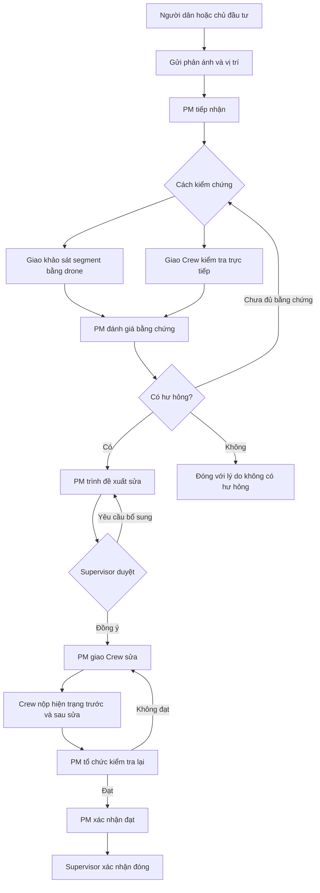
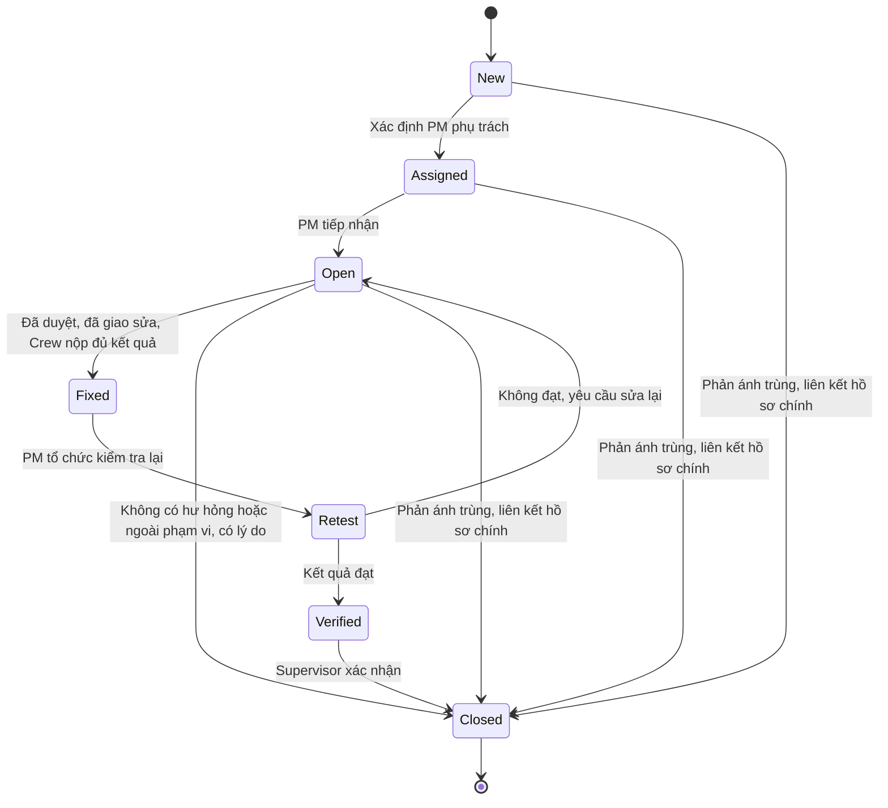

# RoadGuard — Thiết kế phản ánh hư hỏng và phân đoạn tuyến

Ngày: 22/09/2026. Trạng thái: đề xuất thiết kế theo yêu cầu mới; chưa triển khai backend.

Tài liệu mô tả phần mở rộng cho người dân/chủ đầu tư báo cáo hư hỏng, PM chia tuyến thành segment, tổ chức kiểm chứng và theo dõi sửa chữa đến khi đóng hồ sơ. Các lựa chọn ghi là “đề xuất” là giả định thiết kế, chưa phải quyết định đã được chủ sản phẩm xác nhận.

## 1. Yêu cầu và lựa chọn thiết kế

Yêu cầu của người dùng:

- Thêm một role cho người dân hoặc chủ đầu tư gửi phản ánh cho PM.
- PM chọn khảo sát bằng drone hoặc giao Repair Crew kiểm chứng trực tiếp.
- Khi xác nhận có hư hỏng, PM trình cấp trên; chỉ sau khi được duyệt mới giao sửa.
- Repair Crew báo cáo hiện trạng sau sửa, có bước kiểm tra lại và đóng hồ sơ.
- Supervisor nhập tuyến đã thi công/bàn giao, gồm điểm đầu và điểm cuối.
- PM chia tuyến thành nhiều segment có điểm đầu và điểm cuối, dùng làm phạm vi giao khảo sát và nhận video.
- Luồng chính: `New -> Assigned -> Open -> Fixed -> Retest -> Verified -> Closed`.
- Phần sửa chữa chỉ quản lý phương án sửa ở mức mô tả tổng quát do PM nhập; không quản lý dữ liệu tài chính, quy trình thi công chi tiết, giai đoạn thi công, vật liệu hoặc định mức từng hạng mục.
- Mỗi ảnh Reporter gửi có vị trí riêng: GPS điện thoại gắn với ảnh hoặc tọa độ vị trí hư hỏng do người gửi nhập/chọn thủ công.
- Reporter xem quá trình tiếp nhận, kết luận có lỗi/không phải lỗi và kết quả sau sửa kèm hình ảnh.
- Luồng PM chủ động lên lịch khảo sát gốc/định kỳ được giữ lại, không phụ thuộc có phản ánh hay không.
- PM có thể đổi chiều dài segment thành 100 m hoặc giá trị khác, chia/gộp và chỉnh ranh giới trên tuyến.
- Có hệ thống AI bên ngoài nhận dữ liệu khảo sát qua BE; phạm vi phân tích phải truy vết tới segment, vùng quan sát và phiên bản dữ liệu.
- Khảo sát có thể yêu cầu quan sát mép trái/mép phải để phát hiện vết mẻ; bay lệch có chủ đích không mặc nhiên là sai số GPS.

Lựa chọn đề xuất:

- Một role mới `Reporter`, phân loại người báo cáo thành `Citizen` hoặc `InvestorRepresentative`.
- Cấp trên duyệt sửa và xác nhận đóng hồ sơ là `Supervisor`, phù hợp vai trò hiện có.
- Chuỗi trạng thái mới thuộc `IncidentCase` — hồ sơ xử lý sự cố; không thay tất cả trạng thái khảo sát, Defect và đợt sửa bằng một enum chung.
- PM nhận đề xuất chia theo chiều dài mục tiêu, chỉnh sửa trên bản đồ rồi công bố bộ segment.
- MVP yêu cầu Reporter đăng nhập; tiếp nhận ẩn danh và quyền xem toàn dự án của chủ đầu tư là phạm vi cần thiết kế riêng nếu có nhu cầu.

### 1.1. Giới hạn nghiệp vụ sửa chữa

Trong phạm vi: PM nhập phương án sửa tổng quát dạng văn bản cho phạm vi lỗi được đề xuất; Supervisor duyệt phiên bản đó; PM giao Crew; Crew nộp kết quả và ảnh sau sửa; PM kiểm tra kết quả. Nếu đề xuất có nhiều lỗi, chỉ lưu thông tin đủ liên kết lỗi và kết quả thực hiện, không phát triển bảng tài chính hoặc dự toán thi công chi tiết.

Ngoài phạm vi: thiết kế biện pháp thi công từng bước, chia giai đoạn thi công, vật liệu/chủng loại/số lượng/đơn giá chi tiết, nhân công/máy móc, kho, mua sắm và điều hành thi công. Các phase tiếp nhận, kiểm chứng, phê duyệt và nghiệm thu là tiến độ xử lý hồ sơ, không phải giai đoạn kỹ thuật thi công.

Yêu cầu mới chỉ cho PM nhập phương án tổng quát; dữ liệu tài chính bị loại khỏi phạm vi. Quy tắc mới được ghi nhận ở đây để đồng bộ tài liệu cũ khi triển khai.

## 2. Vai trò và quyền

| Vai trò | Trách nhiệm |
|---|---|
| Reporter | Gửi phản ánh, bổ sung bằng chứng, xem phản ánh của mình và kết quả được phép công bố |
| Supervisor | Nhập tuyến đã bàn giao, phân công PM, duyệt phương án sửa, xác nhận hoàn tất cuối cùng |
| Project Manager | Chia segment, tiếp nhận phản ánh, giao kiểm chứng, đánh giá kết quả, trình duyệt, giao sửa và nghiệm thu kỹ thuật |
| Drone Operator | Nhận phạm vi segment, thực hiện khảo sát, nộp video và dữ liệu định vị theo nhiệm vụ |
| Repair Crew | Nhận nhiệm vụ kiểm chứng hoặc sửa chữa, nộp kết quả và bằng chứng trước/sau |

`ReporterType` chỉ phân loại nguồn phản ánh, không tự cấp quyền phê duyệt hoặc quyền quản trị. Reporter không được xem thông tin người báo cáo khác, dữ liệu sửa chữa nội bộ hoặc hồ sơ ngoài phạm vi của mình.

PM và đội tác nghiệp chỉ thao tác trong phạm vi dự án/nhiệm vụ được phân công. Crew không tự xác nhận `Verified` hoặc `Closed` cho công việc mình sửa.

## 3. Tuyến và segment

### 3.1. Supervisor nhập tuyến

Một tuyến/đoạn đường quản lý tiếp tục dùng `RoadSection`, hình học dùng `RoadSectionVersion` hiện có. Segment là đơn vị tác nghiệp con của một phiên bản tuyến, không tạo một bản sao tuyến độc lập cho mỗi km.

Dữ liệu cần có:

- Dự án, mã tuyến, tên tuyến và hồ sơ bàn giao liên quan.
- Hình học đường đi thực tế dạng polyline, chiều lý trình và điểm đầu/điểm cuối.
- Chiều dài tính dọc hình học; lý trình gốc nếu tuyến không bắt đầu tại Km 0.
- Hệ tọa độ được xác định rõ khi nhập và khi hiển thị.

Hai tọa độ đầu–cuối chỉ đủ mô tả một đường thẳng. Với tuyến cong, phải nhập/vẽ/import đường đi thực tế trước khi chia; hệ thống không suy đoán tuyến chỉ từ hai điểm.

Supervisor có thể khởi tạo hồ sơ bằng hai điểm, nhưng tuyến ở trạng thái hình học nháp. PM vẽ/bổ sung các đỉnh theo đường cong, hoặc nhập dữ liệu tuyến có sẵn, rồi xác nhận hình học đủ dùng trước khi công bố segment. Điểm mốc mỗi km không thay thế các đỉnh cần mô tả khúc cua nằm giữa hai mốc.

### 3.1a. Các phương pháp dựng tuyến trên MapLibre

| Phương pháp | Cách dùng | Giới hạn |
|---|---|---|
| PM vẽ/chỉnh polyline trên bản đồ | MapLibre GL JS kết hợp Terra Draw, thêm/kéo các đỉnh ở chỗ đường đổi hướng | Phụ thuộc dữ liệu nền và độ chính xác thao tác; nên nhập hồ sơ tuyến chính thức nếu có |
| Nhập ít điểm và dùng dịch vụ routing | Nhập đầu–cuối và điểm trung gian để lấy đường đi theo mạng đường có sẵn, PM xác nhận | MapLibre không tự tìm đường; dữ liệu mạng đường có thể thiếu đường mới hoặc chọn sai nhánh |
| Import GeoJSON/GPX hoặc dữ liệu GIS | Chuẩn hóa hệ tọa độ, chọn đúng tuyến/chiều, PM duyệt | Cần kiểm tra nguồn, hình học và hệ tọa độ; GPX track cũng không tự là tim đường |
| Drone bay thu GPS | Vẽ track tham khảo trên lớp riêng, lọc dữ liệu và PM chỉnh thành tuyến | Track là vị trí drone, có thể lệch tim đường, có đoạn cất/hạ cánh, vòng lại và mất GPS |
| PM nhập tọa độ mốc km | Dùng làm điểm kiểm tra hoặc hiệu chỉnh lý trình khi có mốc thật | Mỗi km một điểm thường quá thưa để tái hiện đường cong |

Khuyến nghị cho MVP: PM vẽ/chỉnh tuyến trên MapLibre hoặc import hình học đáng tin cậy, dùng GPS drone để đối chiếu, sau đó công bố tuyến chuẩn. Nếu dùng routing, bắt buộc PM xem/chỉnh các nhánh; không coi đường ngắn nhất giữa hai điểm là tuyến dự án đã được xác nhận.

MapLibre có ví dụ chính thức tích hợp Terra Draw để vẽ point/line/polygon [S1]. FE xuất GeoJSON `LineString` theo thứ tự `[longitude, latitude]`, chiều tuyến và lý trình gốc. FE có thể dùng Turf `lineChunk` để xem trước đoạn dài 1 km [S2]. Backend xác nhận lại hình học/chiều dài và trả bộ segment chính thức; không để hai cách đo FE/BE tạo hai bộ mốc khác nhau. Backend có thể trả preview để FE hiển thị đúng mốc sẽ lưu.

Nếu muốn nhập rất ít điểm, cần thêm dịch vụ routing dựa trên dữ liệu đường, ví dụ OSRM [S4]; không chỉ cài MapLibre là có chức năng này. Không dùng kết quả routing để thay hồ sơ tuyến thực tế khi chúng khác nhau.

### 3.2. PM tạo đề xuất chia

PM chọn phiên bản tuyến và chiều dài mục tiêu, ví dụ 1.000 m. Hệ thống tính số segment bằng `ceil(chiều dài tuyến / chiều dài mục tiêu)`, tạo bản xem trước rồi cho PM điều chỉnh.

Chiều dài không cố định 1 km: PM được nhập 100 m, 250 m, 500 m, 1.000 m hoặc chiều dài hợp lệ khác. Ví dụ 100 km chia theo 100 m tạo 1.000 segment. Một nhiệm vụ bay có thể gom nhiều segment liên tiếp; không bắt 1.000 segment phải có 1.000 chuyến bay hoặc 1.000 video gốc.

FE cung cấp bốn thao tác: đổi chiều dài mục tiêu cho toàn tuyến/phạm vi được chọn; chia một segment tại một lý trình; gộp các segment liền kề; kéo điểm ranh giới dọc tuyến hoặc nhập lý trình mới. Điểm kéo phải nằm trên hình học tuyến; sửa hình dáng tuyến là thay đổi RoadSectionVersion riêng.

Được trộn độ dài trong cùng bộ, ví dụ vùng có nhiều lỗi chia 100 m, phần khác giữ 1 km. Khi chọn phạm vi chia lại, preview phải chỉ rõ các đoạn bị ảnh hưởng và đoạn dư; chỉ gộp những đoạn liên tiếp trên cùng phiên bản tuyến. Sau chỉnh sửa vẫn phải phủ đủ tuyến, không chồng/hở.

Nếu bộ segment đã công bố, tạo bản nháp kế tiếp và công bố thành bộ mới; mỗi segment tham chiếu theo định danh thuộc bộ đó, không chỉ theo mã hiển thị. Các nhiệm vụ, video, kết quả AI và hồ sơ sửa đang có vẫn giữ bộ cũ. Lưu liên hệ trước/sau bằng các khoảng lý trình tương giao để truy vết, không tự chuyển kết quả cũ sang ID mới.

Chỉ thay ranh giới segment không bắt buộc chạy lại AI: nếu kết quả có vị trí/phạm vi đủ tin cậy trên cùng tuyến, có thể tạo bản ánh xạ mới kèm nguồn gốc. Kết quả chỉ biết ID segment cũ hoặc vị trí không đủ chính xác thì cần PM đối chiếu hoặc phân tích lại; không tự chia một kết luận “có lỗi” cho tất cả segment con. Đổi hình học tuyến cần quy tắc đối chiếu phiên bản riêng.

Ví dụ tuyến dài đúng 100 km, lý trình gốc Km 0:

| Mã | Đầu | Cuối | Chiều dài |
|---|---|---|---|
| SEG-001 | Km 0 | Km 1 | 1.000 m |
| SEG-002 | Km 1 | Km 2 | 1.000 m |
| SEG-003 | Km 2 | Km 3 | 1.000 m |
| … | … | … | … |
| SEG-100 | Km 99 | Km 100 | 1.000 m |

Nếu tuyến dài 100,4 km, kết quả mặc định là 100 segment dài 1 km và segment cuối dài 400 m. PM có thể điều chỉnh ranh giới tại cầu, nút giao hoặc vị trí phù hợp để tác nghiệp.

Tọa độ ranh giới được nội suy theo khoảng cách dọc polyline trong hệ tọa độ tính toán theo mét. Không chia đều kinh/vĩ độ và không dùng khoảng cách thẳng giữa hai đầu để thay chiều dài đường cong. Lý trình thiết kế có đứt đoạn/nhảy mốc cần bảng quy đổi riêng; MVP dùng khoảng cách liên tục từ lý trình gốc.

Mỗi `RoadSegment` cần có:

| Thuộc tính | Ý nghĩa |
|---|---|
| Id, Code, Sequence | Định danh ổn định, mã và thứ tự segment |
| RoadSectionVersionId | Phiên bản tuyến gốc |
| SegmentSetId | Bộ phân đoạn đã công bố |
| StartOffsetM, EndOffsetM | Khoảng cách từ đầu tuyến, đơn vị mét |
| Geometry | Hình học con được cắt từ tuyến gốc |
| StartPoint, EndPoint | Suy ra từ Geometry; khi trả API phải ghi rõ hệ tọa độ |
| LengthM | Chiều dài segment |

Quy tắc công bố:

- Chiều dài mục tiêu và chiều dài mỗi segment phải lớn hơn 0.
- Các khoảng lý trình phủ đủ tuyến, không có khoảng hở hoặc chồng khoảng; các segment kề nhau dùng chung điểm ranh giới.
- Điểm nằm đúng ranh giới được gán theo khoảng `[đầu, cuối)`; segment cuối chứa cả điểm cuối tuyến. Hư hỏng trải qua ranh giới được liên kết với các segment liên quan.
- Bộ segment đã được nhiệm vụ tham chiếu phải giữ nguyên. Chia lại tạo bộ mới, không sửa hình học của nhiệm vụ cũ.
- Khi tuyến có phiên bản mới, tạo bộ segment cho phiên bản đó; không tự chuyển dữ liệu lịch sử sang tuyến mới.

### 3.3. Giao khảo sát và nhận video

Mỗi hạng mục khảo sát theo segment xác định một segment trong bộ đã công bố, kèm bản đồ, điểm đầu–cuối, hình học, thời hạn và yêu cầu dữ liệu. Một đợt khảo sát có thể gồm nhiều hạng mục cho nhiều segment. Nhiệm vụ thu tuyến trước khi có segment là trường hợp khởi tạo riêng tại mục 3.6.

Một hạng mục có thể có nhiều lượt bay và nhiều tệp video. Tệp phải liên kết đúng nhiệm vụ, segment, lượt bay và phiên bản dữ liệu; một video bao phủ nhiều segment cần ánh xạ khoảng thời gian/phạm vi rõ ràng, không gán tùy ý cho một segment.

Đánh giá dữ liệu phải kiểm tra phạm vi phủ bằng dữ liệu định vị theo thời gian, tính toàn vẹn và chất lượng. Chỉ gắn nhãn `SegmentId` không chứng minh đã bay đủ đoạn. Thiếu phạm vi hoặc thiếu bằng chứng định vị thì yêu cầu bổ sung, không tự xác nhận hoàn tất.

Chiều dài 1 km là đề xuất quản lý có thể cấu hình, không phải cam kết một lần bay sẽ phủ đủ. Backend giao phạm vi và nhận kết quả; điều khiển drone thuộc công cụ vận hành bên ngoài.

### 3.4. Dùng GPS drone và SRT để dựng tuyến, gắn video với km

Không mặc định video nào cũng có SRT bên trong. Tài liệu DJI Mobile SDK cho một API video caption mô tả tệp `.srt` riêng trên thẻ nhớ, cập nhật 1 Hz [S5]; đây không phải cam kết cho mọi dòng drone/firmware. Phải kiểm tra video và tệp đi kèm của thiết bị thực tế trước khi chọn parser.

Quy trình đề xuất:

1. Nhận video gốc, SRT/telemetry gốc và thông tin thiết bị/lượt bay; giữ nguyên tệp gốc.
2. Dùng `ffprobe` xem các stream [S6]. Nếu video có subtitle dạng text tương thích thì dùng FFmpeg chọn stream để xuất; nếu là SRT rời thì đọc trực tiếp. Metadata/data stream riêng của hãng cần parser tương ứng. Không có GPS thì FFmpeg không thể tạo GPS từ video.
3. Parse thời gian, kinh/vĩ độ và chất lượng định vị nếu có; xác định trường đó là vị trí drone, camera hay dữ liệu khác của thiết bị. Kiểm tra đồng bộ thời gian SRT–video, nhất là tệp bị chia, quay nhiều lượt hoặc có thời gian bắt đầu khác nhau.
4. Tách cất/hạ cánh, bay chuyển vị trí, điểm nhảy bất thường và khoảng mất GPS khỏi phần khảo sát; giữ bản gốc và ghi quy tắc xử lý. Không nối thẳng qua khoảng mất dữ liệu để giả lập đã phủ tuyến.
5. Khi dựng tuyến lần đầu: track chỉ là đường gợi ý. PM đối chiếu nền bản đồ/hồ sơ, chỉnh đường cong và xác nhận tuyến chuẩn; lưu nguồn và phiên bản.
6. Với mỗi lần khảo sát: đối chiếu GPS theo thời gian với tuyến chuẩn, lấy khoảng cách dọc tuyến `s` và độ lệch ngang `d`. Xác định thời điểm đi qua các ranh giới segment đã công bố, ví dụ 100 m, 200 m hoặc 1.000 m, 2.000 m; không dùng số giây cố định để xác định km. Đối với góc quay nghiêng, vị trí drone chỉ là gợi ý phạm vi, cần đối chiếu vùng mặt đường thực xuất hiện trong ảnh.
7. Lưu ánh xạ `VideoId + SegmentId + StartTime + EndTime + độ tin cậy`. Một segment có thể có nhiều khoảng video khi drone bay lại; tách lượt bay/chiều bay, không ép tất cả thành một khoảng liên tục.

Ưu tiên giữ video gốc và lưu các khoảng thời gian để xem theo segment. Nếu cần xuất clip, FFmpeg cắt theo mốc thời gian đã xác định. `-c copy` không bảo đảm cắt chính xác từng frame tại mốc bất kỳ; khi cần cắt chính xác phải chọn cách giải mã/mã hóa phù hợp [S7]. Độ chính xác cắt hình không làm GPS chính xác hơn.

Tốc độ đều có ích cho chất lượng thu hình nhưng không phải cơ sở chia km: drone có thể dừng, lệch tuyến hoặc quay lại. Ngay cả GPS xuất mỗi giây cũng chỉ cho các mẫu rời rạc; thời điểm qua mốc giữa hai mẫu là nội suy có sai số. Không hứa “chính xác tuyệt đối” khi chưa đánh giá thiết bị và đồng bộ thời gian.

GPS drone không mặc nhiên là vị trí lỗi trên mặt đường trong ảnh. Camera nghiêng có thể nhìn vùng cách drone nhiều mét; xác định vị trí lỗi/độ phủ ảnh cần góc camera, độ cao, mô hình camera và dữ liệu nền phù hợp hoặc PM xác nhận thủ công. Trong MVP, gắn video với segment là liên kết phạm vi khảo sát, không tuyên bố định vị chính xác từng pixel hư hỏng.

Lệnh tham khảo để kiểm tra một video thực tế (chưa chạy vì chưa có tệp mẫu):

```shell
ffprobe -v error -show_streams -show_format -of json flight.mp4
```

Chỉ khi kết quả xác nhận stream subtitle text đầu tiên chứa dữ liệu cần lấy và FFmpeg hỗ trợ giải mã/chuyển đổi stream đó mới dùng ví dụ sau:

```shell
ffmpeg -i flight.mp4 -map 0:s:0 -c:s srt extracted.srt
```

Lệnh này không trích GPS từ metadata tùy ý và không kiểm chứng độ chính xác GPS. Tệp `flight.srt` rời được đọc trực tiếp; subtitle không chứa tọa độ thì kết quả xuất cũng không có tọa độ. Chọn đúng stream sau khi kiểm tra, không mặc định subtitle đầu tiên luôn là telemetry.

### 3.5. Xử lý GPS lần bay sau bị lệch

Giữ nguyên tuyến chuẩn và các segment đã công bố. Lưu đồng thời `RawGpsPoint`, vị trí đối chiếu trên tuyến, lý trình suy ra, độ lệch ngang và mức tin cậy. Không ghi đè GPS gốc, không vẽ lại tuyến chuẩn theo từng lần bay.

- Đối chiếu chỉ trong tuyến/segment và chiều nhiệm vụ đang giao; xem cả chuỗi thời gian, không chỉ điểm gần nhất đơn lẻ.
- Độ lệch ngang với tim tuyến có thể do nhiệm vụ yêu cầu bay cạnh đường. Đánh giá vị trí so với hành lang bay đã giao và vùng cần quan sát; không kết luận GPS sai chỉ vì track cách tim tuyến.
- Nếu chuỗi phù hợp, dùng phép đối chiếu tuyến để tính lý trình tham khảo, vẫn giữ độ lệch ngang và GPS gốc; hình ảnh phải đạt độ phủ/chất lượng cho đúng bên được giao.
- Nếu ra ngoài phạm vi bay dự kiến, mất GPS, nhảy lý trình hoặc có nhiều nhánh gần nhau, đánh dấu cần kiểm tra; PM xem track và video hoặc yêu cầu bay bổ sung. Chỉ từ track thường chưa đủ phân biệt máy thật sự bay lệch với sai số định vị.
- Đường song song, đường cong chữ U, nút giao và cầu vượt cần xét hướng/tiến trình theo thời gian; không tự hút điểm sang đoạn gần nhất nhưng sai tuyến.
- Lệch có hệ thống cả lượt bay chỉ được hiệu chỉnh bằng mốc/dữ liệu tham chiếu có căn cứ và lưu lịch sử, không tự dịch track để làm mọi điểm đạt kiểm tra.
- Ngưỡng lệch là cấu hình được hiệu chỉnh bằng dữ liệu thực tế, bề rộng đường, chất lượng GPS và hình học ảnh. Không đặt một con số cố định cho mọi tuyến hoặc coi “nằm trong ngưỡng” là bằng chứng video phủ đủ mặt đường.

Turf `nearestPointOnLine` hỗ trợ điểm trên tuyến gần nhất và các khoảng cách [S3], phù hợp preview hoặc phép chiếu cơ bản. Chuỗi có nhánh/điểm mơ hồ cần xử lý trình tự; OSRM Match là ví dụ dịch vụ map matching có timestamp và sai số GPS [S4], nhưng kết quả của nó dựa trên mạng đường được cấu hình, không tự bảo đảm đúng tuyến dự án.

### 3.6. Giữ luồng PM lên lịch bay và khởi tạo tuyến

Luồng chính vẫn là: Supervisor tạo dự án/tuyến và phân công PM → PM lập kế hoạch khảo sát → PM tạo yêu cầu và giao Drone Operator → Operator nhận, bay và nộp dữ liệu → PM đánh giá. Có lịch khảo sát gốc, định kỳ và yêu cầu phát sinh từ phản ánh; không bắt buộc có Reporter mới được bay.

Source hiện có `SurveyPlanningController` cho tạo kế hoạch, tạo yêu cầu và hoãn kế hoạch; `SurveyPlanningService` kiểm tra role PM, phạm vi dự án, thời gian và phiên bản tuyến. Đây là kết quả đọc source, chưa phải kết quả chạy smoke/test trong lần cập nhật tài liệu này.

Phương án ưu tiên tránh phụ thuộc vòng: PM vẽ/import tuyến trước → xác nhận tuyến → chia segment → lập lịch khảo sát gốc theo segment. Drone bổ sung bằng chứng để PM hiệu chỉnh nếu cần; xác nhận hình học tuyến và xác nhận baseline tình trạng mặt đường là hai quyết định khác nhau.

Nếu chủ động chọn bay để thu hình học trước khi có tuyến chuẩn, cần mở rộng một nhiệm vụ `RouteCapture` theo tuyến nháp/hành lang và điểm đầu–cuối, không bắt có bộ segment hoàn chỉnh. PM vẫn lên lịch và giao nhiệm vụ. Kết quả là track tham khảo; PM duyệt hình học rồi mới chia segment và xác nhận/phân bổ phạm vi các khảo sát tiếp theo.

`RouteCapture` chưa có sẵn trong code được kiểm tra. Lệnh tạo kế hoạch hiện yêu cầu `RoadSectionVersionId` khác rỗng; không thể cho rằng bỏ trường này là chạy được. Cần thiết kế phạm vi nháp hoặc loại nhiệm vụ riêng, giữ liên kết tệp khảo sát gốc với lần thu thập và bản ánh xạ được PM xác nhận.

Quyền lưu hình học cũng cần cập nhật có chủ đích: source RoadSectionVersionService hiện chỉ cho Supervisor tạo/chuyển phiên bản. Thiết kế mới cho PM vẽ nháp trong phạm vi dự án; đề xuất Supervisor xác nhận/công bố hình học, sau đó PM công bố bộ segment. Không tuyên bố PM đã có API lưu tuyến chỉ vì FE đã vẽ được.

### 3.7. Khảo sát mặt đường và mép trái/phải

Mỗi phạm vi khảo sát khai báo `TargetBand`: `Surface`, `LeftEdge` hoặc `RightEdge`; một nhiệm vụ có thể yêu cầu nhiều vùng. Trái/phải tính theo chiều tăng lý trình của tuyến, không theo hướng drone bay hoặc bên trái/phải màn hình. Tuyến nhiều phần đường cần thêm phần đường được khảo sát để tránh nhầm mép ngoài với mép dải phân cách.

Ví dụ segment Km 2+000–2+100 yêu cầu đủ cả mép trái và mép phải. Drone có thể bay hai lượt với góc quay phù hợp hoặc một lượt nếu dữ liệu thực sự nhìn rõ cả hai mép. Một lượt bay bên trái không tự chứng minh ảnh đang quay mép trái; phải xem hướng camera và vùng mặt đường xuất hiện trong ảnh.

Giao nhiệm vụ theo vùng quan sát, phạm vi lý trình và yêu cầu chất lượng; lưu lượt bay, hướng bay, vị trí GPS và góc camera nếu thiết bị cung cấp. Góc quay/độ cao phải được chọn sau thử nghiệm để nhìn thấy loại vết mẻ cần phát hiện; tài liệu không mặc định một góc hay khoảng lệch áp dụng được mọi tuyến.

Theo dõi chất lượng/độ phủ riêng cho từng `Segment + TargetBand + SurveyDataVersion`. Mép trái đã đạt nhưng mép phải bị che khuất hoặc mờ thì chỉ yêu cầu thu bổ sung phần thiếu. Có video hoặc AI chạy thành công chưa đủ xác nhận đã khảo sát đủ hai mép.

Phát hiện lưu bên đường, bằng chứng trong ảnh và vị trí nếu đủ tin cậy. Giữ tách biệt vị trí drone, điểm tham chiếu trên tuyến và vị trí lỗi trên mặt đường; chưa định vị được thì đánh dấu cần PM xác nhận, không gán GPS drone thành GPS lỗi.

Thiết kế AI, manifest dữ liệu, job bất đồng bộ, xử lý phát hiện trùng và quy tắc hai mép được mô tả trong [Thiết kế tích hợp AI và khảo sát mép đường](RoadGuard_AI_Segment_Edge_Design_v1.md).

## 4. Tiếp nhận và kiểm chứng



Phản ánh lưu người gửi, thời điểm, mô tả và bằng chứng. Mỗi ảnh đính kèm phải có tọa độ riêng được Reporter xác nhận. Không bắt Reporter biết mã segment: hệ thống gợi ý từ vị trí, PM xác nhận tuyến/phạm vi phù hợp. Vị trí không xác định được dự án vẫn ở `New` để điều phối, không tự giao sai PM.

### 4.1. Vị trí của từng ảnh Reporter gửi

Mỗi `ReportPhoto` lưu tệp ảnh, kinh độ/vĩ độ của vị trí phản ánh, nguồn tọa độ (`DeviceCapture`, `Exif`, `Manual`), thời điểm chụp nếu có, thời điểm gửi và độ chính xác thiết bị báo về nếu có. Không tự đặt độ chính xác cho tọa độ nhập tay.

- Chụp trong ứng dụng: lấy GPS điện thoại lúc chụp, cho người dùng xem và xác nhận vị trí lỗi trên bản đồ.
- Chọn ảnh cũ: đọc EXIF GPS nếu có để gợi ý, nhưng vẫn cho sửa vị trí; thiếu EXIF thì yêu cầu nhập tọa độ hoặc đặt ghim.
- Không dùng vị trí điện thoại lúc tải ảnh cũ lên để mặc nhiên coi đó là vị trí lúc chụp. GPS máy ảnh/điện thoại là vị trí thiết bị; nếu người chụp đứng cách lỗi, cho đặt ghim đúng điểm hư hỏng.
- Nhập tay có thể nhập cặp lat/lon hoặc chọn điểm trên tuyến. Kiểm tra miền giá trị và hiển thị bản đồ để tránh đảo kinh/vĩ độ hoặc đặt sai tuyến.
- Nếu dùng cùng một vị trí cho nhiều ảnh, Reporter phải chủ động xác nhận; không tự gán GPS ảnh đầu cho tất cả ảnh còn lại.
- Giữ vị trí/nguồn ban đầu và lịch sử hiệu chỉnh. GPS người dùng cung cấp là bằng chứng cần kiểm chứng, không chứng minh lỗi là thật.

Các ảnh quá xa nhau được gợi ý tách thành nhiều phản ánh hoặc phân loại theo sự cố khi PM tiếp nhận; không ép mọi ảnh vào một segment sai phạm vi.

### 4.2. Tiến độ trả về Reporter

Tiến độ Reporter là lịch sử sự kiện công khai trên `IncidentReport`, tách khỏi trạng thái hồ sơ nội bộ và phê duyệt phương án. Không ánh xạ chỉ theo enum `Open`, vì trong Open có cả tiếp nhận, kiểm chứng và chờ sửa.

| Hiển thị | Sự kiện tạo trạng thái | Nội dung Reporter nhận |
|---|---|---|
| Đã gửi | Reporter gửi thành công | Mã phản ánh và thời điểm gửi |
| Đang tiếp nhận | PM bắt đầu xem/xử lý phản ánh | Xác nhận đang được tiếp nhận; không chỉ do phân công tự động |
| Đã tiếp nhận | PM xác nhận nhận xử lý | Phạm vi đã nhận, bước tiếp theo là kiểm chứng |
| Đang kiểm chứng | PM giao drone hoặc Crew kiểm tra | Cách kiểm tra và cập nhật phù hợp để công bố |
| Phát hiện lỗi | PM kết luận có hư hỏng từ bằng chứng | Kết luận và mô tả lỗi; chưa nói đã duyệt hoặc đã sửa |
| Không phải lỗi | PM kết luận không có hư hỏng | Bắt buộc lý do do PM nhập; kết thúc nhánh không sửa |
| Chờ sửa / Đang xử lý sửa chữa | Có phê duyệt/giao sửa hoặc cập nhật thực tế tương ứng | Tiến độ tổng quát; không hiển thị dữ liệu tài chính hay giai đoạn thi công chi tiết |
| Đang kiểm tra sau sửa | Crew đã nộp kết quả, PM đang kiểm tra | Chưa xác nhận đã sửa xong với Reporter |
| Đã sửa xong | PM kiểm tra đạt và công bố kết quả | Nội dung kết quả, thời điểm, ảnh sau sửa của đúng lỗi được báo |

Luồng tối thiểu: `Đang tiếp nhận -> Đã tiếp nhận -> Phát hiện lỗi / Không phải lỗi (lý do)`. Nhánh có lỗi tiếp tục đến `Đã sửa xong + ảnh sau sửa`. Các bước kiểm chứng/chờ sửa/kiểm tra sau sửa được hiển thị khi có sự kiện thực tế, không tạo tiến độ giả.

Đề xuất thời điểm công bố “Đã sửa xong” là khi hồ sơ đạt `Verified` và PM công bố kết quả; `Closed` sau đó là xác nhận cuối của Supervisor. Crew vừa nộp `Fixed` chưa đủ công bố thành công. Nếu Retest không đạt thì thông báo đang xử lý sửa lại, không từng hiển thị hoàn tất trước đó.

Ảnh sau sửa phải liên kết đúng lỗi/phạm vi phản ánh, được máy chủ xác nhận và PM chọn công bố. Trường hợp hồ sơ có nhiều lỗi, Reporter nhận kết quả cho phần liên quan; không dùng ảnh một vị trí để kết luận mọi lỗi đã sửa.

Phản ánh trùng hoặc ngoài phạm vi dùng nhãn/lý do riêng; không gọi “Không phải lỗi”. Trùng thì liên kết hồ sơ chính và theo dõi kết quả ở đó. Mỗi sự kiện lưu người thực hiện, thời điểm, lý do/nội dung công bố và ảnh liên quan.

Nhiều phản ánh có thể liên quan cùng một sự cố. PM liên kết chúng vào một `IncidentCase`, giữ nguyên nguồn gửi và bằng chứng; không tạo nhiều nhiệm vụ sửa cho cùng lỗi đang được xử lý.

Phản ánh chưa qua kiểm chứng không tự trở thành `Defect` đã xác nhận. PM đánh giá dữ liệu khảo sát hoặc kết quả thực địa rồi ghi kết luận, lý do và bằng chứng.

Thay đổi so với tài liệu cũ: cho phép chọn nhánh drone hoặc thực địa ở bước kiểm chứng ban đầu. Đề xuất chỉ dùng bằng chứng drone để kết luận khi đủ chứng minh vấn đề; nếu cần số đo vật lý hoặc dữ liệu không đủ thì PM giao kiểm tra thực địa bổ sung. AI hoặc trạng thái tải video thành công không tự xác nhận hư hỏng.

Nhiệm vụ kiểm tra trực tiếp từ phản ánh phải tạo được khi chưa có Survey. Không tạo khảo sát giả để thỏa khóa ngoại hiện tại của `FieldInspectionTask`.

## 5. Trạng thái hồ sơ sự cố

| Trạng thái | Ý nghĩa | Điều kiện/người chuyển |
|---|---|---|
| New | Phản ánh mới, chưa có PM chịu trách nhiệm | Reporter gửi; hệ thống tạo hồ sơ |
| Assigned | Đã có PM phụ trách | Điều phối theo dự án hoặc Supervisor phân công |
| Open | PM đã tiếp nhận; đang kiểm chứng, chờ duyệt hoặc tổ chức sửa | PM tiếp nhận hồ sơ |
| Fixed | Crew báo cáo hoàn thành phần sửa thuộc hồ sơ | Đúng Crew được giao; đủ kết quả và bằng chứng; chưa phải nghiệm thu |
| Retest | Đang kiểm tra lại sau sửa | PM tiếp nhận kết quả và tổ chức kiểm tra |
| Verified | Kết quả sửa đạt yêu cầu | PM xác nhận từ kết quả kiểm tra lại |
| Closed | Hồ sơ kết thúc | Supervisor xác nhận hoàn tất đối với hồ sơ đã sửa |



`Assigned` là giao trách nhiệm hồ sơ cho PM. Việc giao drone, giao kiểm chứng và giao sửa dùng các nhiệm vụ riêng, tránh hiểu nhầm rằng đã giao sửa trước phê duyệt.

Trong `Open`, giao diện thể hiện bước đang xử lý từ dữ liệu nghiệp vụ: kiểm chứng, chờ bổ sung, chờ duyệt, bị trả lại hoặc đang sửa. Phê duyệt có trạng thái riêng: `Draft`, `PendingApproval`, `Approved`, `Returned`, `Rejected`.

Không cho nhảy thẳng `Open -> Verified/Closed` với lý do đã sửa xong. Nhánh đóng không sửa phải có `ClosureReason` như `NoDefect`, `Duplicate`, `OutOfScope`, người quyết định và bằng chứng/lý do tương ứng. PM được đóng các trường hợp này; phản ánh trùng phải liên kết hồ sơ chính để tiếp tục theo dõi kết quả.

Supervisor từ chối đề xuất sửa không có nghĩa là không có hư hỏng. Hồ sơ vẫn `Open` để PM xử lý tiếp; không tự đóng vì đề xuất bị từ chối.

Kiểm tra lại không đạt chuyển về `Open`, giữ toàn bộ lần sửa và lần kiểm tra trước. Nếu thay đổi phạm vi hoặc phương án ngoài phê duyệt, phải trình phiên bản mới trước khi giao phần sửa phát sinh.

Nếu một hồ sơ gồm nhiều lỗi/hạng mục, chỉ lên `Fixed` khi toàn bộ hạng mục bắt buộc đã nộp kết quả; chỉ lên `Verified` khi tất cả đã đạt. Hạng mục đã đạt không bị mất kết quả vì một hạng mục khác phải sửa lại.

MVP đề xuất tạo hồ sơ tái phát mới liên kết hồ sơ đã `Closed`, thay vì mở lại và ghi đè kết quả đóng cũ.

## 6. Phê duyệt, nghiệm thu và truy vết

- PM lập đề xuất từ hư hỏng đã được xác nhận, nhập phương án sửa tổng quát cho Supervisor; không nhập dữ liệu tài chính hoặc quy trình thi công/vật liệu chi tiết.
- Supervisor duyệt, trả lại hoặc từ chối phiên bản cụ thể, kèm lý do khi không chấp thuận.
- PM chỉ giao sửa từ phiên bản hiện tại đã duyệt. Quy tắc này không chặn giao nhiệm vụ kiểm chứng trước phê duyệt sửa.
- Crew báo cáo trước/sau sửa bằng ảnh/video, thời điểm, vị trí và mô tả công việc. Tệp phải được máy chủ xác nhận hợp lệ trước khi dùng làm bằng chứng hoàn thành.
- PM nghiệm thu kỹ thuật, Supervisor xác nhận kết thúc; lưu người, thời điểm, quyết định và bằng chứng của từng bước.
- Reporter nhận kết luận kiểm chứng; nếu không phải lỗi thì có lý do PM nhập; nếu đã sửa thì nhận kết quả được PM xác nhận và ảnh sau sửa. Phản ánh gộp trùng theo dõi tiến độ hồ sơ chính.
- Chuyển trạng thái, giao lại, phê duyệt và nộp báo cáo phải chống cập nhật đồng thời và lặp yêu cầu; không nhân đôi nhiệm vụ hoặc bằng chứng khi retry.

## 7. Mô hình dữ liệu khái niệm

| Thành phần | Trách nhiệm/quan hệ |
|---|---|
| Reporter | Role mới trên tài khoản; loại người gửi không thay thế kiểm tra quyền |
| IncidentReport | Nội dung phản ánh nguyên gốc; người gửi, vị trí, bằng chứng; liên kết hồ sơ xử lý |
| ReportPhoto | Tọa độ và nguồn GPS riêng cho mỗi ảnh; vị trí gốc, vị trí xác nhận và lịch sử hiệu chỉnh |
| ReportStatusEvent | Tiến độ công khai cho Reporter, lý do PM nhập, kết luận và ảnh sau sửa được công bố |
| IncidentCase | Vòng đời New–Closed, PM phụ trách, phạm vi tuyến/segment và lý do kết thúc |
| IncidentCaseHistory | Lịch sử chuyển trạng thái và thay đổi người phụ trách, chỉ bổ sung |
| RoadSegmentSet | Bộ phân đoạn của một RoadSectionVersion; nháp/công bố, có lịch sử |
| RoadSegment | Khoảng lý trình và hình học thuộc bộ phân đoạn |
| Survey work item | Phạm vi một segment; liên kết nhiệm vụ, lượt bay và dữ liệu video |
| Flight track / video interval | GPS gốc, thời gian, vị trí đối chiếu, sai lệch và các khoảng video theo segment; nguồn dữ liệu không bị ghi đè |
| Survey coverage requirement/result | Phạm vi cần quan sát và độ phủ/chất lượng riêng cho mặt đường, mép trái, mép phải |
| ProcessingBlock/Job/AIDetection | Tái sử dụng nền tảng hiện có; mở rộng manifest theo segment/vùng quan sát và tích hợp AI bên ngoài |
| FieldInspectionTask | Mở rộng nguồn từ hồ sơ phản ánh hoặc Defect; không bắt buộc có khảo sát cho nguồn trực tiếp |
| Defect | Hư hỏng chuyên môn có nguồn/bằng chứng; liên kết hồ sơ, không dùng như phản ánh chưa xác minh |
| RepairBatch/Version/Item | Tái sử dụng đề xuất sửa, phiên bản phê duyệt và các hạng mục |
| Repair inspection result | Kết quả kiểm tra lại từng hạng mục và từng lần sửa |

Tên thành phần mới là tên thiết kế, chưa khẳng định có bảng hoặc API tương ứng trong source. Các khóa ngoại và quan hệ chi tiết cần được xác định khi thiết kế persistence.

`Defect.Verified` hiện có nghĩa là xác nhận hư hỏng trước sửa; `IncidentCase.Verified` mới có nghĩa là kết quả sau sửa đã đạt. API/UI phải phân biệt “Hư hỏng đã xác nhận” và “Sửa chữa đã nghiệm thu”, không đổi nghĩa enum cũ hoặc ánh xạ dữ liệu cũ chỉ dựa vào tên giống nhau.

## 8. Tác động và thứ tự triển khai

| Phần | Kết quả cần đạt | Phụ thuộc |
|---|---|---|
| 1. Role và phản ánh | Reporter, tiếp nhận, phân phối PM, quyền xem, gộp trùng, hồ sơ New/Assigned/Open | Identity, phạm vi dự án và lưu trữ bằng chứng hiện có |
| 2. Segment | Gợi ý chia, PM chỉnh/công bố, phiên bản bất biến, phạm vi nhiệm vụ/video | RoadSectionVersion và hình học tuyến |
| 3. Kiểm chứng | Drone hoặc thực địa từ phản ánh, PM kết luận và liên kết Defect | Phần 1–2, survey và inspection |
| 4. Duyệt và giao sửa | Phiên bản đề xuất, Supervisor quyết định, chỉ giao sửa đã duyệt | Hư hỏng đã xác nhận, nghiệp vụ repair |
| 5. Kiểm tra lại và đóng | Fixed/Retest/Verified/Closed, sửa lại, lịch sử và kết quả cho Reporter | Phần 3–4, bằng chứng sau sửa |

Checkout hiện có nền tảng RoadSection/RoadSectionVersion, survey planning và inspection; FieldInspectionTask hiện yêu cầu cả SurveyId và DefectId nên chưa hỗ trợ trực tiếp phản ánh mới. Các kế hoạch P1/P2-40–53 mô tả các phần kiểm chứng và sửa chữa liên quan; việc có kế hoạch không chứng minh mọi endpoint đã được triển khai.

Tài liệu liên quan cần đồng bộ khi triển khai thiết kế:

- [Đặc tả use case](Dac_ta_UseCase_v2.md): role Reporter, tiếp nhận, chia segment và nhánh kiểm chứng.
- [User stories và acceptance criteria](User_Stories_Acceptance_Criteria_v2.md): quyền mới, segment, vòng đời hồ sơ.
- [Domain model](RoadGuard_Domain_Model_v1.md): hồ sơ, bộ segment và ý nghĩa riêng của Verified.
- [Data Dictionary](RoadGuard_Data_Dictionary_v1.md): trường dữ liệu, quan hệ nguồn phản ánh và phiên bản segment.
- [ERD](RoadGuard_ERD_v1.md): quan hệ mới, nguồn kiểm chứng không cần Survey.

Tài liệu này là thiết kế mục tiêu đã được liên kết với bản đồ tài liệu tại [docs/README.md](../README.md). Code/runtime vẫn chưa được tuyên bố triển khai; khi triển khai cần ánh xạ dữ liệu hiện hữu, bao gồm nhiệm vụ đang mở, thay vì thay hàng loạt trạng thái hoặc gán lại phiên bản tuyến.

## 9. Tiêu chí nghiệm thu thiết kế

1. Reporter gửi phản ánh và chỉ xem nội dung trong phạm vi được phép; loại chủ đầu tư không tự tăng quyền.
2. Vị trí được đối chiếu với tuyến, phản ánh tới đúng PM; chưa xác định tuyến thì không tự giao sai.
3. Tuyến 100 km với mục tiêu 1 km tạo 100 segment liên tục; tuyến 100,4 km có đoạn cuối 400 m.
4. Chia tuyến cong theo chiều dài polyline, điểm ranh giới nằm trên tuyến và dùng hệ tọa độ đúng.
5. Đổi bộ segment hoặc phiên bản tuyến không làm đổi phạm vi nhiệm vụ và video cũ.
6. Operator nhận rõ segment, nộp được nhiều video/lượt bay; thiếu dữ liệu phủ không được coi là hoàn tất.
7. PM giao được kiểm chứng trực tiếp từ phản ánh khi chưa có Survey hoặc Defect được xác nhận.
8. Phản ánh, AI detection hoặc việc tải video không tự xác nhận hư hỏng hay tự tạo lệnh sửa.
9. Chưa duyệt hoặc đã đổi phiên bản đề xuất thì không giao sửa bằng phê duyệt cũ.
10. Crew nộp kết quả chỉ đạt Fixed; kiểm tra lại đạt mới được Verified; Supervisor xác nhận mới Closed với lý do đã sửa.
11. Retest không đạt quay lại sửa, giữ lịch sử; thiếu hoặc không đạt một hạng mục thì chưa nghiệm thu toàn hồ sơ.
12. Không có hư hỏng/trùng/ngoài phạm vi kết thúc với lý do riêng; trả phương án không tự đóng hồ sơ.
13. Cập nhật đồng thời, retry, gộp trùng và điều chuyển PM không gây mất lịch sử, nhân đôi việc hoặc lộ dữ liệu.
14. Phần sửa chỉ yêu cầu phương án tổng quát; không đòi dữ liệu tài chính, vật liệu, định mức hay giai đoạn thi công chi tiết để trình duyệt.
15. Mỗi ảnh phản ánh có GPS riêng từ lúc chụp/EXIF hoặc nhập tay; ảnh cũ thiếu GPS không bị gắn vị trí điện thoại lúc upload.
16. PM bắt đầu xử lý thì report chuyển Đang tiếp nhận; xác nhận nhận xử lý thì Đã tiếp nhận. Kết luận Không phải lỗi bắt buộc lý do.
17. Reporter chỉ nhận Đã sửa xong khi PM kiểm tra đạt và công bố kết quả có ảnh sau sửa đúng phạm vi; không nhận thông báo này khi Crew mới nộp Fixed.
18. Track GPS lệch giữa các lượt bay không đổi tuyến/segment chuẩn; trường hợp xa/mơ hồ được đánh dấu cần kiểm tra và giữ GPS gốc.
19. Không có SRT/telemetry GPS thì không hứa trích được tọa độ; tệp rời được tiếp nhận riêng, giữ đồng bộ và nguồn gốc.
20. Mốc km dựa trên tuyến chuẩn và thời gian GPS đối chiếu, không chia video chỉ theo tốc độ đặt trước; bay lại/mất GPS không bị tính là phủ đủ tuyến.
21. PM vẫn tạo lịch khảo sát gốc/định kỳ khi không có Reporter; phương án RouteCapture trước segment phải được triển khai riêng, không giả định API hiện có hỗ trợ.
22. PM chia 100 km thành 1.000 segment dài 100 m, chỉnh/chia/gộp được trên preview; công bố lại không đổi tham chiếu nhiệm vụ hoặc kết quả AI cũ.
23. Bay ngược chiều không đổi nhãn mép trái/phải; bay lệch chủ đích trong phạm vi giao không bị coi ngay là lỗi GPS.
24. Độ phủ mép trái và mép phải được đánh giá riêng; vùng thiếu dữ liệu không được báo “không có lỗi”.
25. Job AI truy vết được input/model/segment/side; retry không nhân đôi kết quả; AI không tự xác nhận lỗi, duyệt sửa hoặc báo Reporter đã hoàn tất.

## 10. Nguồn kỹ thuật đã đối chiếu

Các trang chính thức được đọc ngày 22/09/2026. Cần đối chiếu phiên bản thư viện và mẫu dữ liệu thiết bị thực tế khi triển khai.

- [S1 — MapLibre: vẽ hình với Terra Draw](https://maplibre.org/maplibre-gl-js/docs/examples/draw-geometries-with-terra-draw/).
- [S2 — Turf: lineChunk](https://turfjs.org/docs/api/lineChunk), chia LineString theo chiều dài.
- [S3 — Turf: nearestPointOnLine](https://turfjs.org/docs/api/nearestPointOnLine), vị trí gần nhất và khoảng cách dọc/ngang tuyến. Tên thuộc tính thay đổi theo phiên bản; kiểm tra phiên bản FE đang dùng trước khi viết code.
- [S4 — OSRM API: Route và Match](https://project-osrm.org/docs/v5.24.0/api/), routing/map matching dựa trên mạng đường, có timestamp và thông tin sai số GPS.
- [S5 — DJI Mobile SDK: Camera / setVideoCaptionEnabled](https://developer.dji.com/api-reference/android-api/Components/Camera/DJICamera.html), ví dụ thiết bị/API tạo tệp SRT riêng; không suy rộng mọi model.
- [S6 — ffprobe](https://ffmpeg.org/ffprobe.html), kiểm tra stream/metadata thực có trong tệp.
- [S7 — FFmpeg](https://ffmpeg.org/ffmpeg.html), chọn stream, stream copy và giới hạn seek/cắt theo thời gian.
