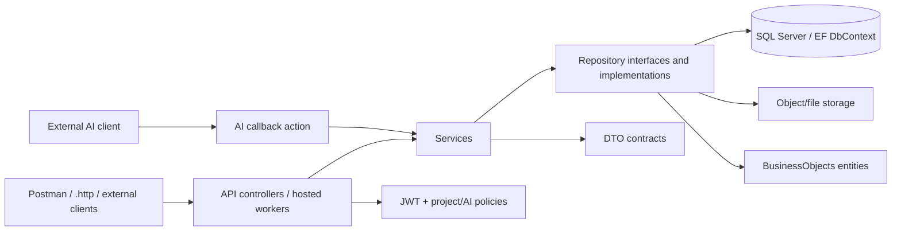

# RF-01: Source/module/code map

## Identity and evidence boundary

- Branch `anh`; surveyed local HEAD `2efc8a5775f834c7f0fe37cc0ce703011649e1f1`; working tree dirty. Remote `origin/anh` matched that SHA at RF-01 start, but local source includes uncommitted survey changes.
- `CURRENT_VERIFIED` below means source/caller/static test evidence observed. No runtime HTTP behavior is claimed; RF-00 API test host failed before assertions. `PROPOSAL` and `UNKNOWN` are not product decisions.
- `01-endpoint-inventory.md` lists all 57 controller actions. This map covers module relationships and non-HTTP entry points. Source reading used `rg --files`, `rg -n`, DI registrations, project references, route attributes, repository interfaces, tests and Postman JSON. No source was edited or script run.

## Layer and module graph

This is observed source wiring, not an endorsement of current business semantics. `RoadGuardSystem.slnx` and `.csproj` give the project-level graph; `API/Extensions/ServiceCollectionExtensions.cs`, `Services/Extensions/AuthenticationServiceCollectionExtensions.cs`, and `Repositories/Extensions/RoadGuardPersistenceExtensions.cs` give runtime DI. `RoadGuardDbContext.cs` is the common persistence hotspot.

| Module | Main source | Depends on | Cross-module effect / risk | Preliminary class, confidence, condition |
|---|---|---|---|---|
| API platform | `API/Program.cs`, `API/Extensions/ServiceCollectionExtensions.cs`, middleware, auth handlers | all Services, JWT/session, DB config | uniform errors, auth, startup seeding, versioning | KEEP / high for runtime role; validate error contract and safe API test host |
| Identity/session/onboarding | Auth, Profile, Me, Users, Invitations, ReporterRegistrations controllers; identity Services/Repositories | `ApplicationUser`, sessions, OTP/invitation, mail sender | account authority, PII, token and email side effects | MODIFY / medium; reconcile profile/me and reset contracts before change |
| Project/road/membership/warranty | Projects/RoadSections/Warranties/WorkPackage controllers and project Services/Repositories | identity actor, scope guard, spatial model, file handover | scope and effective-date authority | KEEP / medium; validate roles, route version and warranty source rules |
| Survey/planning/task/dataset | SurveyPlanning + SurveyV2 controllers, both Services/Repositories | project/road, identity/operator, files, processing | same plan/request tables, concurrency, immutable dataset | NEEDS-DECISION / high for coexistence; compare workflows and data compatibility |
| File/upload/storage | UploadsController, UploadService, UploadPersistenceService, `MinioUploadObjectStorage` | project scope, survey dataset, storage provider | offline upload/retry, immutable bytes, file scope | KEEP / medium; verify provider and durable-effect tests |
| Inspection/defect | InspectionTasksController and read service; defect/inspection entities/configurations | project/survey, human decisions | task scope and state, many target-only contract claims | MODIFY / low; RF-02 business trace needed before designing endpoints |
| Processing/AI/validation | ProcessingV2Controller, service/repository, ValidationRunWorker | survey dataset, file, AI model, project scope | callback trust, late result, retries, measurements | KEEP / medium for observed slice; verify AI/offline contract and worker proof |
| Notification/audit/outbox | NotificationsController, NotificationPersistenceService, OutboxWorkRepository, NotificationOutboxConsumer, audit/idempotency components | all mutation modules | delivery scheduling, dedup, redaction, transaction | MODIFY / medium; locate runtime dispatcher, verify no silent backlog |
| Seeder/fixtures | `tools/RoadGuardSystem.Seeder/Program.cs`, `Repositories/Implementations/Seeding/*`, `API/Extensions/DbInitializer.cs` | almost all persisted modules | startup writes and RF-00 fixture collision | MODIFY / high need; isolate API test startup before new smoke |

`IProjectScopeGuard` is shared by survey V2, upload, processing and some project flows; it calls `IProjectMembershipRepository`. `IdentityRepository` implements both old and V2 repository interfaces. SurveyPlanning and SurveyV2 implementations both write `SurveyPlans`, `SurveyRequests` and postponement-related rows. Survey dataset submission also reads `Files`, `FileScopes`, `UploadSessions` and writes `SurveyDataVersions`/`SurveyFiles` in the dirty partial file. These are dependency facts from implementations, not proof the states are correct.

## Entry points other than ordinary HTTP actions

| Entry point | Registration/caller found | Behavior and durable dependency | Status |
|---|---|---|---|
| Process startup | `API/Program.cs` -> `AddRoadGuardSeeding`; optional `DbInitializer.InitializeAsync` | may apply migrations/seed in Development when configured; RF-00 startup hit Postman fixture collision | CURRENT_VERIFIED; startup effects need isolated test |
| Seeder CLI | `tools/RoadGuardSystem.Seeder/Program.cs` | direct database seeding via repository package; CI calls it after migration update | CURRENT_VERIFIED; not run in RF-01 |
| Upload verification worker | `Program.cs:28` registers `UploadVerificationWorker` only in Development with Minio endpoint; worker calls `IUploadService.ProcessOneVerificationAsync` every 30s | storage state and upload session/file mutations | CURRENT_VERIFIED registration; provider runtime unverified |
| Validation worker | `ServiceCollectionExtensions.cs:87` registers `ValidationRunWorker`; it calls `IProcessingV2Repository.CompleteNextValidationRunAsync` in a 1s loop | validation run/result persistence | CURRENT_VERIFIED registration; runtime outcome unverified |
| Outbox consumer | `RoadGuardPersistenceExtensions.cs:105-106` registers `NotificationOutboxConsumer` and `IOutboxWorkRepository`; consumer uses `ConsumerEffectService` receipt | notification/outbox durable effect | Registered but **no production caller/host dispatcher found** via repository search; integration tests call `ConsumeAsync`. External dispatcher unverified. |
| AI result callback | `ProcessingV2Controller.ReceiveAiResult` at POST `/api/v1/internal/processing-jobs/{jobId}/results` | named `AiCallback` policy uses AI JWT scheme and `client_type=AI_SERVICE`; service/repository persist result/idempotency | HTTP entry point serving an external producer; producer outside repo unverified |
| Scheduled jobs | Quartz packages exist in Services `.csproj`; search of production `.cs` found no `IJob`, `AddQuartz` or `UseQuartz` registration | no scheduled Quartz job proven in this checkout | UNKNOWN external schedule; package presence alone is not runtime job |
| Offline sync | `operationId: syncOperations` exists in target OpenAPI; no production controller action, `MapPost`, `SyncOperation` implementation found | no running sync flow proven | TARGET_DOCUMENTED only; RF-02 product/contract decision required |
| Health | `Program.cs` maps GET `/health` | process liveness only, no DB check | CURRENT_VERIFIED; excluded from 57 controller actions |

## Caller and consumer trace

- In-repo HTTP consumers: `docs/postman/RoadGuardSystem-V2.postman_collection.json` has 84 request examples; 52/57 action shapes are matched. `RoadGuardSystem.API/RoadGuardSystem.API.http` covers the five actions absent from Postman. These are examples, not deployed-client telemetry.
- Tests: API suites under `tests/RoadGuardSystem.ApiTests/{Authentication,Identity,Projects,Warranties,Surveys,Files,Notifications,Inspections,Authorization,Platform}`; SQL suites under matching IntegrationTests domains; unit Service/architecture suites under UnitTests. The inventory maps groups to test files; test presence is not runtime proof.
- Internal DI consumers: all 57 actions call injected Services; additional worker/consumer rows above. `ISurveyAssignmentService` is registered but no production controller/worker caller found. Some project/survey repository seams are used indirectly from Services.
- External web/mobile clients, deployed AI worker, Postman runners, integrations and historical URLs are outside this repository and `UNKNOWN`. An absent in-repo caller is never sufficient to remove an endpoint.

## Risks to take into RF-02

1. **Authorization:** `/profile` and `/me` expose different fields; global user role versus project membership and AI callback policy need actor/scope matrix. See `ProfileController`, `MeController`, `ProjectScopeGuard`, `ProjectAccessAuthorizationHandler`, `ServiceCollectionExtensions.cs`.
2. **Data loss/state:** old and V2 survey flows share `SurveyPlan`/`SurveyRequest` tables. Removing either route or converting rows without mapping existing states/scopes may orphan plans, tasks, assignments, datasets and files.
3. **Atomicity/retry:** `IdempotencyOperationService`, `RoadGuardTransactionService`, per-repository `ExecuteInTransactionAsync`, outbox receipts and `DbUpdateConcurrencyException` handling are not uniform. Map exact effects before consolidating.
4. **Concurrency:** `/profile` places rowversion in body and reports 409; `/me` uses `If-Match` and reports 412/428. Survey old uses body `OperationId` and some 409 conflicts; survey V2 uses header key/If-Match and 412/428. Multiple clients may depend on both.
5. **Offline/external AI:** upload session, storage verification worker, dataset admission and AI callback span files/survey/processing. OpenAPI sync operation is not implemented in source. Check retry/late-result behavior against real field workflow, not V2 name alone.
6. **Baseline test environment:** RF-00 API platform failure at seeder means API tests currently cannot establish endpoint behavior in that configuration. No additional runtime tests were run in RF-01.
