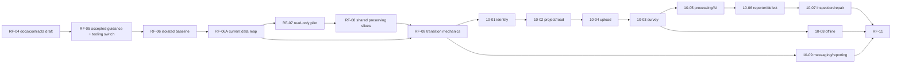

# RF-03: Master plan and implementation task graph

## Execution amendment — 2026-10-01

The owner's post-RF-09 direction supersedes the provisional two-writer schedule below for **current execution**. Anh is the sole refactor writer on `anh`; Huy has no assigned work and `huy` is untouched. Historical A/B entries remain traceability, not current assignments. After a reviewed common refactor baseline, the proposed development identities are **Huy = A (`huy`)** and **Anh = B (`anh`)**. Web/Android/AI consumer owners remain UNKNOWN under decision 44; neither developer is assigned their implementation. See [slice ledger](10-refactor-slices.md), [local completion gate](10-refactor-checklist.md), [development draft](11-development-plan.md), and [handoff baseline](11-handoff-baseline.md).

RF-10 parents now contain separate R (preserving refactor), C (characterization), F (new behavior/contract/data) and G (consumer, retirement and release) slices. R/C can START on their own evidence without waiting for deployed SQL audit; an F/G gate never becomes a dependency for unrelated R/C. A parent stays Partial while its F/G work remains. RF-09 remains Partial for external consumer/deployed proof. This amendment does not revise its historical test result. The graph below describes module integration dependencies for the former combined tasks, not an enforced serial order for independent R/C work.

## Baseline, authority and gate

- Branch `anh`; surveyed local HEAD `2efc8a5775f834c7f0fe37cc0ce703011649e1f1`; `origin/anh` matched at RF-00/01 checks, not revalidated as a remote freshness claim here. Working tree is dirty: existing survey source/test/planning edits and untracked RF planning files. No checkout, commit, push or production edit in RF-03.
- Inputs: `00-baseline.md`, `00-tooling-dependencies.md`, `01-code-map.md`, `01-endpoint-inventory.md` (57 actions + `/health`), `01-legacy-register.md` (L01-16), `02-requirements-traceability.md` (R01-18), `02-contract-gaps.md` (CG01-17), `02-decision-register.md` (32-44 Accepted on 2026-09-30; Q-RF02-01 resolved), `02-adr-transition.md` (ADR 001-006). The draft OpenAPI has 133 parsed operations, not 133 implemented actions.
- RF-04..11 are **PROPOSED tasks**, not authorization to mutate production, public contract, schema, CI or old docs. RF-04/05 draft new content; activation of new `AGENTS.md`/`.agents/` requires explicit user acceptance. All subsequent implementation packages need their own scoped approval, particularly public contract/data/external effects.

## Work waves and dependency graph

| Wave/task | Deliverable and change class | Entry gate / dependency | Exit evidence |
|---|---|---|---|
| RF-04 | New `docs/product/`, `docs/backend/`, `contracts/`, `docs/decisions/` drafts; 57-current/133-draft operation and ADR/requirement crosswalk. Documentation only. | RF-03 reviewed; source owners for unresolved statements identified. | Complete links/ID map; no silent contract activation. |
| RF-05 | Draft new `AGENTS.md`/`.agents/`, manifest and validator/CI switch; activate only after user accepts exact set. Documentation/tooling transition. | RF-04 content and crosswalk complete; user acceptance for activation. | One active guidance version; old/new guard comparison, CI and path checks. |
| RF-06 | Isolated SQL/API/storage fixture and characterization baseline; resolve CG15 before HTTP claims. Test infrastructure, behavior-preserving. | RF-05 activation; no shared DB writes. | Reproducible isolated host, recorded baseline failures and focused API/SQL proof. |
| RF-06A | Current ERD, complete data dictionary and model/snapshot/migrated SQL inventory; docs/tooling only. | RF-06 owned Testcontainers baseline; no shared DB writes. | Source-hashed inventory, coverage, isolated catalog comparison and drift register; RF-07/09 consume it. |
| RF-07 | Pilot GET work-package through Controller/Service/Repository; behavior-preserving structure. | RF-06 green isolated host, RF-06A current data map and consumer/wire baseline. | Status/body/headers/project-scope/SQL projection unchanged, focused tests pass. |
| RF-08 | Shared error/auth/idempotency/concurrency/outbox seams characterized and extracted in behavior-preserving slices only. | RF-07 pilot; CG01-04/L15-16 compatibility matrix. | No public-wire or durable-effect drift; cross-module checks pass. |
| RF-09 | Contract and schema/data transition machinery: consumer registry, version/deprecation plan, migration/backfill/restore rehearsal template. No blanket schema apply. | RF-04 operation map, RF-06 isolated DB, RF-06A current ERD/dictionary, RF-08 seam baseline. | Per-change expansion/rollback gates, owner-approved migration/contract packages only. |
| RF-10-01..09 | Module-specific changes listed below; structure and new behavior are separate checkpoints. | RF-09 plus each module's decision and provider/data gate. | Per-module API/SQL/consumer evidence; no broad service rewrite. |
| RF-11 | Release reconciliation, old docs/ADR/agent retirement from active tree, final regression and rollback plan. | All included RF-10 modules complete or explicitly deferred; user approves retirement. | Requirement/operation/link crosswalk, CI/contract/consumer checks, Git provenance. |

Arrows indicate prerequisite facts, not mandatory sequential staffing. RF-10-06 can build Reporter intake before AI integration, but its AI candidate checkpoint waits for RF-10-05. RF-10-09 can characterize notification delivery before other modules; reporting/retention waits for source events and Q-RF02-08. No task above depends on a descendant; remaining cross-team approvals are external gates, not graph edges.

## Final provisional classification and coverage

`KEEP` means preserve current behavior and role pending proof; `MODIFY` means scoped improvement; `REPLACE` means a separately approved target/compatibility transition; `REMOVE-CANDIDATE` never authorizes deletion; `NEEDS-DECISION` blocks the named behavior/contract. Confidence describes source evidence, not correctness.

| Scope / coverage IDs | Class, confidence, verification condition | Owning task |
|---|---|---|
| API host and 57 action inventory + `/health`, CG15-16 | KEEP platform / high source count; MODIFY isolated fixture/Postman coverage after consumer checks. All 57 current actions mapped; 133 draft operation IDs each reconciled or explicitly deferred. | RF-04, RF-06, RF-08, RF-11 |
| R01-03 identity/authorization; L01-04, L08; CG01-03 | NEEDS-DECISION for `/profile`/`/me` and reset routes / high overlap; MODIFY auth transport under accepted 36A/37 after Q-RF02-02 and consumer proof. No route removal from naming. | RF-08, RF-10-01 |
| R04-05 project/road/GIS/warranty; CG05 | KEEP existing project/warranty/road actions / medium; MODIFY target segment flow after geometry, actor and 39A pilot tests. | RF-07, RF-10-02 |
| R06-07 survey/dataset; L05-07, L14; CG04/06/10 | NEEDS-DECISION / high shared rows. Existing paths KEEP until Q-RF02-03; new baseline/coverage remains deferred at UNKNOWN until Q-RF02-05. | RF-10-03; RF-10-04 for source video/SRT |
| R08-09 Reporter/defect; CG07-08 | MODIFY current onboarding and defect candidate schema / medium; REPLACE target-only report/case/label workflow only after privacy/schema approval. Accepted 33A/34A do not prove implementation. | RF-10-06 |
| R10-12 measurement/Fast Track/repair; CG09 | KEEP measurement/validation evidence / medium; NEEDS-DECISION for policy thresholds/materials and PM generic-proposal boundary; accepted 32A/35A scoped. | RF-10-07 |
| R13 file/upload/storage; CG10/17 | MODIFY / high static size mismatch (`int.MaxValue` versus 8 GiB); REPLACE size representation through expansion/backfill only after data/consumer plan. | RF-10-04, RF-09 |
| R14 processing/AI; CG11 | MODIFY / medium static attempt issue; provider protocol remains Proposed, Q-RF02-06. External AI code is outside BE per 44. | RF-10-05 |
| R15-16 offline/idempotency/concurrency; L16; CG12 | MODIFY shared primitive / medium; `syncOperations` is target-only and NEEDS-DECISION on Android wire/keys. | RF-08, RF-10-08 |
| R17-18 notification/audit/reporting/retention; L12; CG13-14 | MODIFY notification/outbox / medium; REPLACE target-only reporting/retention after policy mechanics Q-RF02-08. 40 target unverified. | RF-10-09 |
| L09 generic `ApiResult`, L10 generic DTOs | REMOVE-CANDIDATE / medium declaration-only scoped search; full solution/SDK/reflection/consumer check before deletion. | RF-08 audit, RF-11 retirement gate |
| L11 registered SurveyAssignmentService | REMOVE-CANDIDATE / low; DI/plugin/future-flow caller check and survey decision first. | RF-10-03, RF-11 |
| L13 unused Quartz reference | REMOVE-CANDIDATE / low; deployment/job reflection check before package removal (not an incidental upgrade). | RF-10-09, RF-11 |
| L15 controller-local ProblemDetails maps | MODIFY / high overlap; preserve wire until CG01 consumer approval. | RF-08, RF-10-01 |

Known gap ownership is exhaustive: CG01-03 -> RF-08/10-01; CG04-06 -> RF-10-02/03; CG07-09 -> RF-10-06/07; CG10 -> RF-10-04; CG11 -> RF-10-05; CG12 -> RF-10-08; CG13-14 -> RF-10-09; CG15 -> RF-06; CG16 -> RF-04/11; CG17 -> RF-09/10-04. R01-18 and L01-16 are assigned above. The 133 individual draft operation dispositions are an RF-04 deliverable, since RF-02 mapped modules rather than approving every draft operation.

## Contract, data and recovery discipline

- **Structure-only checkpoint:** capture current route, body, status, headers, auth, SQL effects and outbox; move/extract behind same contract; rerun affected tests. Revert the isolated code slice if it drifts; no schema contract or data change is bundled.
- **Public contract checkpoint:** name web/Android/AI/operator/Postman/`.http` consumers and any outside-repo unknowns; approve new version/compatibility period, examples, SDK/FE snapshot and Postman update in one package. Old path remains until measured or acknowledged retirement; fallback is route/feature-flag reversal while old data remains readable.
- **Schema/data checkpoint:** inventory existing row populations and applied migration history on an authorized copy; write forward-only migration with nullable/additive columns and dual read/write when needed; backfill in bounded restartable batches with audit counts/checksum; rehearse rollback/restore and old-reader compatibility. No applied migration is deleted or edited; destructive contract phase needs separately approved data-retention decision.
- **External side effects:** fake AI/storage in automated tests; use isolated Testcontainers SQL. Test with a real provider only in an approved isolated environment; verify durable receipt/retry/duplicate and permission expiry. Never modify a shared database as a test side effect.

## Can proceed versus gated

- **Can plan immediately:** RF-04 drafts/crosswalk, RF-05 draft guidance/validator diff, RF-06 isolation design and RF-07 pilot characterization design; CG17 migration analysis, 32-44 source mapping. These are planning/read-only until later implementation authorization.
- **Requires user acceptance:** activation of new agent set/tooling switch, public route/error/auth changes, schema/data migration and old-doc removal. Q-RF02-02/03/04/05/06/07/08 gate their respective RF-10 checkpoints. Missing original 2026-09-28 32-44 question text is provenance-only, not a blocker.
- **External evidence missing:** current web/Android/AI consumers and owners, deployed SQL row/migration state, real video/SRT/route samples, storage/AI provider contract, performance benchmark and restore drill. Each relevant task records the absence instead of claiming success.

Every RF-04..11 task uses the revised seven-section report form in `templates/task-report.md` and writes `planning/refactor/reports/<task-id>.md`. A task file is the checkpoint and is marked Done only when its named gates pass; if a decision blocks one checkpoint, complete independent ones and mark Partial.

## Two-developer execution supplement — 2026-09-30

[03-two-developer-plan.md](03-two-developer-plan.md) adds proposed A/B ownership for all 16 tasks, per-slice start/integration/release dependencies, shared-file single-writer reservations, self-review and cross-owner discussion notes. This supplements the prerequisite evidence graph above; it does not remove business/data/activation gates. Whole-module arrows are integration gates where a documented independent slice can start earlier against an agreed interface.

Reports use [templates/task-report.md](templates/task-report.md); cross-owner issues use [templates/coordination-note.md](templates/coordination-note.md). Each task's new ownership section is provisional until the two developers accept that slice. No production/Git action was performed by this archive update.
