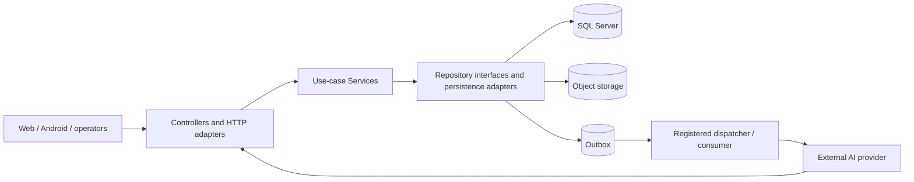

# RF-03: Target architecture proposal

## Evidence and status

- Branch `anh`; surveyed local HEAD `2efc8a5775f834c7f0fe37cc0ce703011649e1f1`; working tree dirty with the pre-existing survey/planning changes in `00-baseline.md` and untracked `planning/refactor/`. RF-03 changes planning files only.
- `CURRENT_VERIFIED`: `RoadGuardSystem.slnx`, project references, 17 controllers/57 actions, shared `RoadGuardDbContext`, workers and repositories in RF-00/01. `TARGET_CONFIRMED`: exact Appendix D 32-44 requirements reconfirmed 2026-09-30 in `02-decision-register.md`. Everything below marked **PROPOSED** until accepted; no active code or contract changes.
- Preserve the existing ASP.NET Core controller -> Service -> Repository/EF project structure for the first refactor pass. RF-01 found no measured reason to replace the framework or rewrite all layers. Module boundaries are ownership and dependency rules within this structure, not new deployable services.

## Responsibility and dependency proposal

- Controllers bind/validate transport shape, identify caller, invoke a use case and map its result to the **approved version of** HTTP response/error. Existing route/error/status behavior remains until a consumer-backed transition is accepted (CG01-04). No controller owns EF queries or workflow decisions.
- Services own actor/project authorization, workflow and state policy, coordination of repository operations and result facts. Keep historical implementation differences visible; do not normalize errors or idempotency merely for style.
- Repositories own EF mappings, durable queries/writes, rowversion checks, idempotency record, transaction, outbox insert and storage metadata. A use case that changes several owned aggregates must state its transaction boundary; SQL transaction cannot atomically commit external object storage or AI delivery. Use outbox/receipt and compensating state there.
- BusinessObjects retain persisted entities/invariants; DTOs represent versioned wire contracts. Do not collapse near-name DTOs (`/profile`/`/me`, old/V2 survey) until data and consumer decisions are made (L01-08).

## Module ownership proposal

| Module / task | Owned durable facts and primary seam | Allowed inbound dependencies | Cross-boundary rule |
|---|---|---|---|
| Identity / RF-10-01 | user, session, refresh, OTP, invitation and security logs; `IdentityRepository` | none for core identity | Project authorization reads actor identity; no other module rotates credentials. Accepted 36A/37 require planned cookie/mobile compatibility, not immediate switch. |
| Project/road/warranty / RF-10-02 | project, membership/effective dates, road section/version, segment set, warranty/handover | identity actor | Publishes scope/version facts; survey and file modules consume by ID/version, not by owning writes. 39A is pilot configuration. |
| Survey/dataset / RF-10-03 | plans, requests, assignments, tasks, survey data versions/files, coverage decision | project scope, file verification | Own old/V2 row interpretation and its SQL transaction. UNKNOWN coverage stays explicit until Q11 evidence/authority exists. |
| File/upload / RF-10-04 | stored file, file scope, upload session/parts and storage verification | project scope, caller | Storage bytes and SQL metadata use a recoverable state machine. Accepted 38 needs a controlled size-type/schema transition (CG17). |
| Processing/AI / RF-10-05 | processing job/attempt/result, model provenance, validation run | survey dataset, files, project scope | BE owns adapter/contract/fixtures/integration under 44; external AI owns AI service. Callback authority, attempt fencing and receipt need Q-RF02-06. |
| Reporter/defect / RF-10-06 | report/case, defect candidates, PM assessment, label approval, public projection | project/road, AI detections, files | Candidate selection and approved training labels follow 33A/34A; AI cannot merge or approve. Public projection requires Q-RF02-07. |
| Inspection/Fast Track/repair / RF-10-07 | field sessions/measurements, policy versions, repair proposals/attempts/acceptance | project, defect, files | Separate temporary safety action (35A), method policy, proposal, traffic release and final acceptance; no invented thresholds. |
| Offline sync / RF-10-08 | sync operation receipt and conflict/handover provenance | project authorization, survey/task, file, identity | Android owns local queue. BE rechecks current permission on reconnect; 42A/43A define pilot scope, while wire/key handling needs consumer agreement. |
| Notification/audit/reporting/retention / RF-10-09 | inbox, outbox receipt, audit projection, export/report and retention/hold decisions | events from all modules | Producers insert outbox with source mutation; consumer delivery is independently retried. 40 is an unverified target; 41A is project policy with WAITING_RETENTION_BASIS. |
| Platform/fixtures / RF-06/08/09 | composition, error adapter, isolated seed/test infrastructure, shared transaction primitives | module contracts | Shared changes are staged after characterization; `DbInitializer` and fixture collision (CG15) are explicit entry risks. |

`RoadGuardDbContext` remains one physical context initially. Logical ownership is enforced through use-case/repository review and operation tests; a schema split is **not** assumed. Cross-module writes need one named coordinating Service and a transaction diagram. For project membership, authorization reads the current membership/effective dates at command execution; cached/offline claims alone do not grant project writes (R03/R15).

## Shared operational contracts

| Concern | PROPOSED target and preserved-current rule | Required proof / open decision |
|---|---|---|
| Authentication/authorization | Accepted 36A/37: secure web cookie plus server session, Android rotating access/refresh; actor, role and project membership checks at each sensitive operation. Keep bearer/current routes during a planned compatibility window. | Q-RF02-02, real web/Android consumers, CSRF/CORS and isolated wrong-actor/wrong-scope tests. |
| Errors | One versioned stable error catalogue and ProblemDetails mapping; do not silently rename current lowercase codes to draft uppercase codes. | CG01 and consumer branching inventory; capture status/body/headers before migration. |
| Idempotency/concurrency | Key scope = actor/project/operation/payload version; replay returns original durable outcome; version precondition enforced on contested writes. Preserve body-key/409 routes while comparing header-key/412/428 routes. | L16/CG04; isolated SQL replay, stale-writer and response-shape tests; exact key model is PROPOSED. |
| Transaction/outbox | Commit state, audit and outbox row together for each SQL mutation; lease/receipt consumer independently with dedup. External storage/AI gets retryable receipt, never treated as part of SQL commit. | CG11/13; find production dispatcher, failure/restart and lease tests; AI protocol Q-RF02-06. |
| Offline | Versioned downloaded geometry/task references, ordered operation receipts, conflict states, original actor preserved through supervised encrypted handover. Local unsynced evidence is never removed by server token expiry. | Accepted 42A/43A; external Android wire/key owner, Q-RF02-03/07 where survey/report effects overlap. |
| Storage/retention | Immutable source bytes, checksum/provenance, SQL metadata and verification state; authorized download; hold-aware retention calculation. Unknown warranty end stays WAITING_RETENTION_BASIS. | Accepted 38/41A; CG17 type/backfill/restore rehearsal and Q-RF02-08 for deletion mechanics. |
| BE-AI | Versioned manifest/result, source/file/model/attempt identity, active-attempt check and receipt; AI results remain candidates for human decisions. | 44 ownership accepted; specific two-stage/receipt protocol remains Q-RF02-06 PROPOSED. |

## Change classes and recovery

1. **Behavior-preserving structure:** move/extract only after route/body/status/headers, SQL effects, auth and event characterization. Roll back by reverting the isolated slice; no schema or public contract delta is included.
2. **Business/public contract:** use a versioned compatibility matrix, consumer owner/telemetry, parallel period and explicit retirement gate. Revert routing/feature flag while keeping old data readable; never infer unused from absent in-repo caller.
3. **Schema/data:** forward-compatible expand -> dual-read/write or backfill -> verify counts/checksums/constraints -> cut over -> contract. Rehearse on isolated snapshot; preserve applied migrations, plan backup/restore and forward repair rather than deleting applied migration files.

The RF-07 pilot is GET `/projects/{projectId}/work-package` (`ProjectWorkPackagesController`, Service, repository, project scope). It spans all layers and authorization while remaining read-only. Preserve current method/path/DTO/error wire; RF-06 must first provide a clean isolated API host. Pilot success establishes delivery method, not approval to refactor every endpoint.
